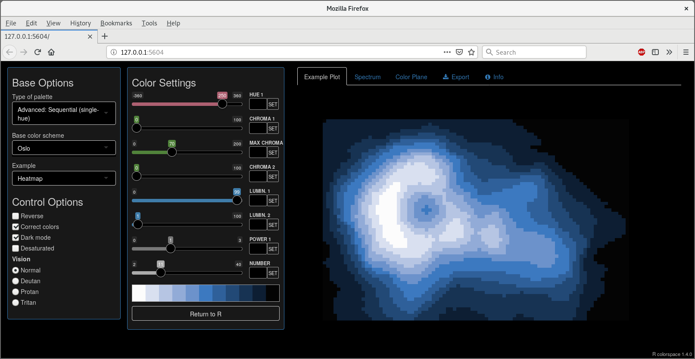
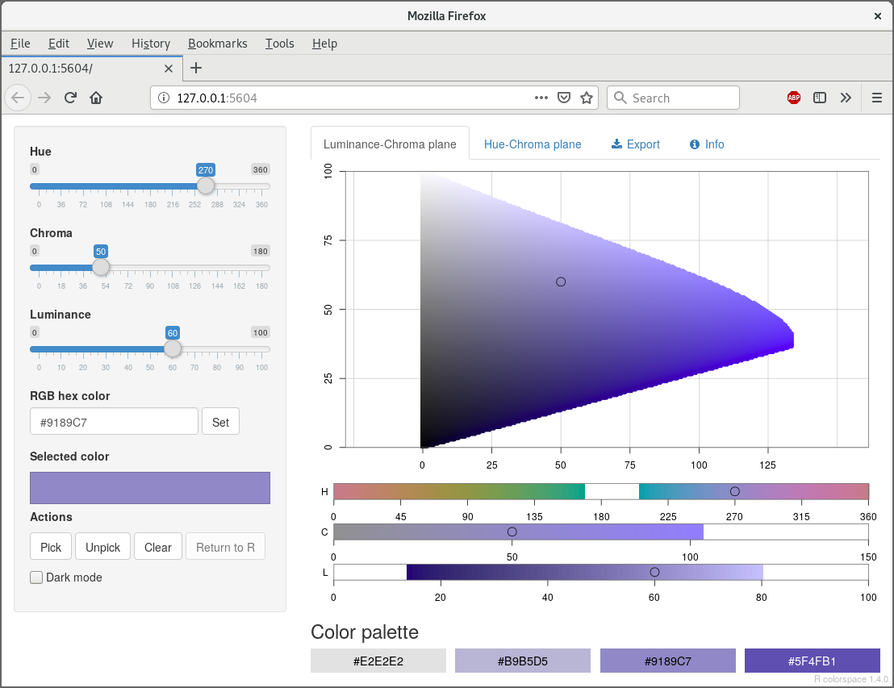
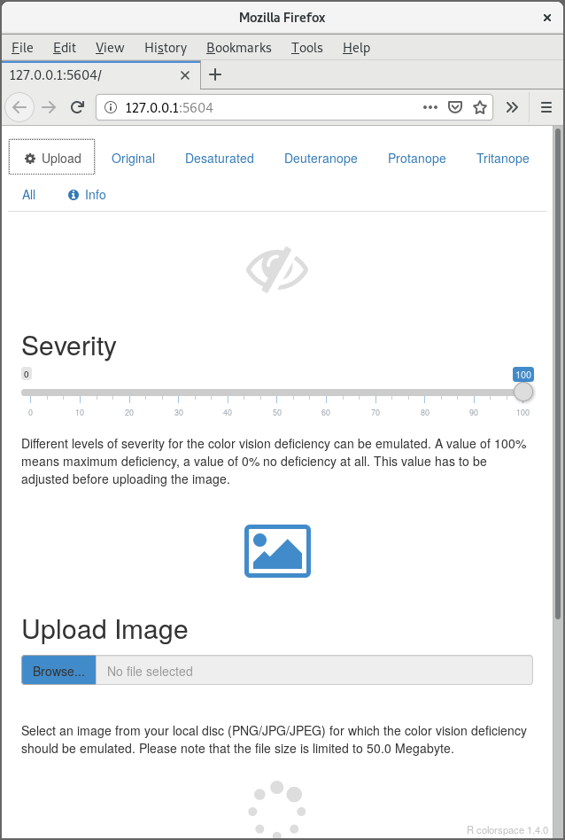
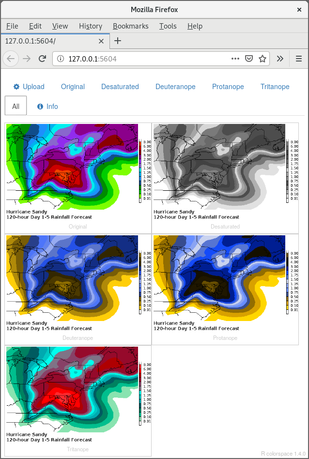

---
author:
  - name: Achim Zeileis
    # primary affiliation
    affiliation: Universität Innsbruck
    # full address
    address: |
      | Department of Statistics
      | Faculty of Economics and Statistics
      | Universitätsstr. 15
      | 6020 Innsbruck, Austria
    email: \email{Achim.Zeileis@R-project.org}
    url: https://eeecon.uibk.ac.at/~zeileis/
  - name: Jason C. Fisher
    affiliation: U.S. Geological Survey
  - name: Kurt Hornik
    affiliation: |
      | WU Wirtschafts-
      | universität Wien
  - name: Ross Ihaka
    affiliation: University of Auckland \AND
  - name: Claire D. McWhite
    affiliation: |
      | The University of
      | Texas at Austin
  - name: Paul Murrell
    affiliation: University of Auckland
  - name: Reto Stauffer
    affiliation: Universität Innsbruck
  - name: Claus O. Wilke
    affiliation: |
      | The University of
      | Texas at Austin
title:
  # title in title case
  formatted: "\\pkg{colorspace}: A Toolbox for Manipulating and Assessing Colors and Palettes"
  # without LaTeX markup (if any)
  plain:     "colorspace: A Toolbox for Manipulating and Assessing Colors and Palettes"
  # with LaTeX markup (if any), used as running title
  short:     "\\pkg{colorspace}: Manipulating and Assessing Colors and Palettes"
abstract: >
  The \proglang{R} package \pkg{colorspace} provides a
  flexible toolbox for selecting individual colors or color palettes, manipulating
  these colors, and employing them in statistical graphics and data
  visualizations. In particular, the package provides a broad range of color
  palettes based on the HCL (Hue-Chroma-Luminance) color space. The three HCL
  dimensions have been shown to match those of the human visual system very well,
  thus facilitating intuitive selection of color palettes through trajectories in
  this space.  

  Namely, general strategies for three types of palettes are provided:
  (1)\ Qualitative for coding categorical information, i.e., where no particular
  ordering of categories is available. (2)\ Sequential for coding ordered/numeric information, i.e.,
  going from high to low (or vice versa). (3)\ Diverging for coding ordered/numeric
  information around a central neutral value, i.e., where colors diverge from
  neutral to two extremes.  

  To aid selection and application of these palettes the package provides scales
  for use with \pkg{ggplot2}; \pkg{shiny} (and \pkg{tcltk}) apps for interactive
  exploration; visualizations of palette properties;
  accompanying manipulation utilities (like desaturation and lighten/darken), and
  emulation of color vision deficiencies.
keywords:
  # at least one keyword, comma-separated and in sentence case
  formatted: [color, palette, HCL, RGB, hue, color vision deficiency, "\\proglang{R}"]
  plain:     [color, palette, HCL, RGB, hue, color vision deficiency, R]
preamble: >
  \usepackage{thumbpdf,lmodern}
  \usepackage{booktabs,amsmath,longtable,supertabular,framed}
  \newcommand{\tex}[1]{#1}
output: rticles::jss_article
bibliography: ../../vignettes/color.bib
---

\tex{\vspace*{-0.4cm}}

# Introduction {#sec:intro}

The \pkg{colorspace} package provides a broad toolbox for selecting individual
colors or color palettes, manipulating these colors, and employing
them in various kinds of visualizations.


```{r preliminaries, echo=FALSE, message=FALSE}
library("colorspace")
library("ggplot2")
theme_set(theme_minimal())
```

At the core of the package there are various utilities for computing with
color spaces (as the name conveys). Thus, the package helps to map various three-dimensional
representations of color to each other. A particularly important
mapping is the one from the perceptually-based and device-independent color model
HCL (Hue-Chroma-Luminance) to standard Red-Green-Blue (sRGB) which is the basis for color
specifications in many systems based on the corresponding hex codes (e.g., in HTML but also
in \proglang{R}). For completeness further standard color models are included as well in the package:
`polarLUV()` (= HCL), `LUV()`, `polarLAB()`, `LAB()`, `XYZ()`, `RGB()`, `sRGB()`, `HLS()`,
`HSV()`.

The HCL space (= polar coordinates in CIELUV) is particularly useful for
specifying individual colors and color palettes as its three axes match those
of the human visual system very well: Hue (= type of color, dominant wavelength),
chroma (= colorfulness), luminance (= brightness), see Figure\ \ref{fig:hcl-properties}.

```{r hcl-properties, echo = FALSE, message = FALSE, warning = FALSE, fig.width = 4, fig.height = 2.2, out.width = "0.5\\textwidth", fig.cap = "Axes of the HCL color space: Hue (= type of color, dominant wavelength), chroma (= colorfulness), luminance (= brightness). In each line the color coordinates are varied along the indicated axis, keeping the other two coordinates fixed."}
swatchplot(
  "Hue"       = sequential_hcl(5, h = c(0, 300), c = c(60, 60), l = 65),
  "Chroma"    = sequential_hcl(5, h = 0, c = c(100, 0), l = 65, rev = TRUE, power = 1),
  "Luminance" = sequential_hcl(5, h = 260, c = c(25, 25), l = c(25, 90), rev = TRUE, power = 1),
  off = 0
)
```

The \pkg{colorspace} package provides three types of palettes based on the HCL model:

* _Qualitative:_ Designed for coding categorical information, i.e.,
  where no particular ordering of categories is available and every color
  should receive the same perceptual weight. Function: `qualitative_hcl()`.
* _Sequential:_ Designed for coding ordered/numeric information, i.e.,
  where colors go from high to low (or vice versa). Function: `sequential_hcl()`.
* _Diverging:_ Designed for coding ordered/numeric information around a central
  neutral value, i.e., where colors diverge from neutral to two extremes.
  Function: `diverging_hcl()`.

To aid choice and application of these palettes there are: scales for use
with \pkg{ggplot2} [@color:ggplot2]; \pkg{shiny} [@color:shiny] [and \pkg{tcltk}, @color:R] apps for interactive exploration;
visualizations of palette properties; accompanying manipulation utilities
(like desaturation, lighten/darken, and emulation of color vision deficiencies).


# Getting started {#sec:start}

## Installation

The stable release version of \pkg{colorspace} is hosted on the Comprehensive \proglang{R} Archive Network
(CRAN) at <https://CRAN.R-project.org/package=colorspace> and the development version of \pkg{colorspace}
is hosted on \proglang{R}-Forge.

For \proglang{Python} users a beta re-implementation of the full \pkg{colorspace} package in
\proglang{Python}\ 2/\proglang{Python}\ 3 is also available, see <https://github.com/retostauffer/python-colorspace>.
In the manuscript we focus on the more mature \proglang{R} implementation but
replication materials for most examples are not only provided for \proglang{R} but
also for \proglang{Python}.


## Choosing HCL-based color palettes

The \pkg{colorspace} package ships with a wide range of predefined color palettes,
specified through suitable trajectories in the HCL (hue-chroma-luminance) color space.
A quick overview can be gained easily with `hcl_palettes()` (see Figure\ \ref{fig:hcl-palettes}):

```{r hcl-palettes, message = FALSE, warning = FALSE, fig.height = 6.75, fig.width = 12, out.width = "\\textwidth", fig.cap = "Overview of available predefined palettes in \\pkg{colorspace}."}
library("colorspace")
hcl_palettes(plot = TRUE)
```

Using the names from the plot above and a desired number of colors in the palette
a suitable color vector can be easily computed, e.g.,

```{r qualitative-hcl-4}
q4 <- qualitative_hcl(4, palette = "Dark 3")
q4
```

The functions `sequential_hcl()`, and `diverging_hcl()` work analogously. Additionally,
their hue/chroma/luminance parameters can be modified, thus allowing to easily customize
each palette. Moreover, the `choose_palette()`/`hclwizard()` app provide convenient user
interfaces to do the customization interactively. Finally, even more flexible diverging
HCL palettes are provided by `divergingx_hcl()`.


## Usage with base graphics

The color vectors returned by the HCL palette functions can usually be passed directly
to most base graphics function, typically through the `col` argument. Here, the `q4`
vector created above is used in a time series display (see Figure \ref{fig:eustockmarkets-plot}):

```{r eustockmarkets, eval = FALSE}
plot(log(EuStockMarkets), plot.type = "single", col = q4, lwd = 2)
legend("topleft", colnames(EuStockMarkets), col = q4, lwd = 3, bty = "n")
```

```{r eustockmarkets-plot, echo = FALSE, message = FALSE, warning = FALSE, fig.height = 4, fig.width = 6, out.width = "0.75\\textwidth", fig.cap = "Time series plot of \\code{EuStockMarkets} data with \\code{qualitative\\_hcl(4, \"Dark 3\")} palette."}
q4 <- qualitative_hcl(4)
par(mar = c(5, 4, 1, 1))
plot(log(EuStockMarkets), plot.type = "single", col = q4, lwd = 2)
legend("topleft", colnames(EuStockMarkets), col = q4, lwd = 3, bty = "n")
```

As another example for a sequential palette a spine plot is created below,
displaying the proportion of Titanic passengers that survived per class.
The `Purples 3` palette is used which is quite similar to the **ColorBrewer.org**
palette `Purples`. Here, only two colors are employed, yielding a dark purple
and light gray.

```{r titanic, eval = FALSE}
ttnc <- margin.table(Titanic, c(1, 4))[, 2:1]
spineplot(ttnc, col = sequential_hcl(2, palette = "Purples 3"))
```

```{r titanic-plot, echo = FALSE, message = FALSE, warning = FALSE, fig.height = 4, fig.width = 6, out.width = "0.75\\textwidth", fig.cap = "Foo."}
ttnc <- margin.table(Titanic, c(1, 4))[, 2:1]
par(mar = c(5, 4, 1, 1))
spineplot(ttnc, col = sequential_hcl(2, "Purples 3"))
```


## Usage with ggplot2

To plug the HCL color palettes into \pkg{ggplot2} graphics suitable discrete and/or
continuous \pkg{gglot2} color scales are provided. The scales are called via the scheme
`scale_<aesthetic>_<datatype>_<colorscale>()`, where `<aesthetic>` is the name
of the aesthetic (`fill`, `color`, `colour`), `<datatype>` is the type of the
variable plotted (`discrete` or `continuous`) and `<colorscale>` sets the type
of the color scale used (`qualitative`, `sequential`, `diverging`,
`divergingx`).

To illustrate their usage two simple examples are shown using the qualitative `Dark 3`
and sequential `Purples 3` palettes that were also employed above. First, semi-transparent
shaded densities of the sepal length from the iris data are shown, grouped by species.


```{r iris-ggplot, message = FALSE, warning = FALSE, fig.height = 4, fig.width = 6, out.width = "0.75\\textwidth", fig.cap = "Foo."}
library("ggplot2")
ggplot(iris, aes(x = Sepal.Length, fill = Species)) + geom_density(alpha = 0.6) +
  scale_fill_discrete_qualitative(palette = "Dark 3")
```

The sequential palette is used to code the cut levels in a scatter of price by carat
in the diamonds data (or rather a small subsample thereof). The scale function first
generates six colors but then drops the first color because the light gray is too light
in this display. (Alternatively, the chroma and luminance parameters could also be tweaked.)

```{r diamonds-ggplot, message = FALSE, warning = FALSE, fig.height = 4, fig.width = 6, out.width = "0.75\\textwidth", fig.cap = "Foo."}
dsamp <- diamonds[1 + 1:1000 * 50, ]
ggplot(dsamp, aes(carat, price, color = cut)) + geom_point() +
  scale_color_discrete_sequential(palette = "Purples 3", nmax = 6, order = 2:6)
```


## Palette visualization and assessment

The \pkg{colorspace} package also provides a number of functions that aid visualization and
assessment of its palettes.

* `demoplot()` can display a palette (with arbitrary number of colors) in a range of
  typical and somewhat simplified statistical graphics.
* `hclplot()` converts the colors of a palette to the corresponding hue/chroma/luminance
  coordinates and displays them in HCL space with one dimension collapsed. The collapsed
  dimension is the luminance for qualitative palettes and the hue for sequential/diverging palettes.
* `specplot()` also converts the colors to hue/chroma/luminance coordinates but draws
  the resulting spectrum in a line plot.

For the qualitative `Dark 3` palette from above the following plots can be obtained.

```{r visualiation-qualitative, eval = FALSE}
demoplot(q4, "bar")
hclplot(q4)
specplot(q4, type = "o")
```

```{r allplots-qualitative, echo = FALSE, fig.height = 4.5, fig.width = 14, out.width = "\\textwidth", fig.cap = "Foo.", dev = "png", dpi = 150}
allplots <- function(palette, ...) {
  layout(cbind(1, 2, 3:4), heights = c(2, 10))
  par(oma = c(2, 5, 2, 3), mar = rep(0.5, 4))
  demoplot(palette, ...)
  hclplot(palette)
  par(xaxt = "n", yaxt = "n", mar = c(0.2, 3, 0.2, 0), cex = 1)
  image(matrix(seq_along(palette), ncol = 1L), col = palette)
  par(yaxt = "s")
  specplot(palette, type = "o", palette = FALSE, oma = FALSE, mar = c(0.2, 3, 0.2, 0))
}
allplots(q4, "bar")
```

A bar plot would be another typical application for a qualitative palette (instead of the
time series and density plot used above). However, a lighter and less colorful palette
might be preferable in this situation (e.g., `Pastel 1` or `Set 3`).

The other two displays show that luminance is (almost) constant in the palette while
the hue changes linearly along the color "wheel". Ideally, chroma would have also been
constant to completely balance the colors. However, at this luminance the maximum
chroma differs across hues so that the palette is fixed up to use less chroma for
the yellow and green elements.

Subsequently, the same assessment is carried out for the sequential `Purples 3` palette
as employed above. 

```{r visualization-sequential, eval = FALSE}
s9 <- sequential_hcl(9, "Purples 3")
demoplot(s9, "heatmap")
hclplot(s9)
specplot(s9, type = "o")
```

```{r allplots-sequential, echo = FALSE, fig.height = 4.5, fig.width = 14, out.width = "\\textwidth", fig.cap = "Foo.", dev = "png", dpi = 150}
s9 <- sequential_hcl(9, "Purples 3")
allplots(s9, "heatmap")
```

Here, a heatmap (based on the well-known Maunga Whau volcano data) is used as a typical
application for a sequential palette. The elevation of the volcano is brought out clearly,
focusing with the dark colors on the higher elevations.

The other two displays show that hue is constant in the palette while luminance and chroma vary.
Luminance increases monotonically from dark to light (as required for a proper sequential palette).
Chroma is triangular-shaped which allows to better distinguish the middle colors in the palette
(compared to a monotonic chroma trajectory).


# Color spaces: S4 classes and utilities  {#sec:color_spaces}

At the core of the \pkg{colorspace} package there are various utilities for computing with
color spaces (as the name conveys). Thus, the package helps to map various three-dimensional
representations of color to each other, see @color:Ihaka:2003. A particularly important
mapping is the one from the perceptually-based and device-independent color model
HCL (Hue-Chroma-Luminance) to standard Red-Green-Blue (sRGB) which is the basis for color
specifications in many systems based on the corresponding hex codes (e.g., in HTML but also
in R). For completeness further standard color models are included as well in the package.
The connections are illustrated in the following graph:


```{r color-spaces, fig.width = 9.5, fig.height = 4.5, echo = FALSE, out.width = "0.9\\textwidth", fig.cap = "Foo."}
par(mar = rep(0, 4))

d <- data.frame(
  x = c(1, 1, 2, 2, 3, 4, 5, 5, 5, 6),
  y = c(1, 3, 1, 3, 2, 2, 1, 3, 2, 2),
  lab = c("polarLAB", "polarLUV\n(= HCL)", "LAB", "LUV", "XYZ", "RGB", "HLS", "HSV", "sRGB", "hex"),
  stringsAsFactors = FALSE
)

plot(0, 0, type = "n", axes = FALSE, xlab = "", ylab = "",
  xlim = c(0.7, 6.3), ylim = c(0.4, 3.6))
lines(y ~ x, data = d[-c(1, 3, 7, 8),])
lines(y ~ x, data = d[c(1, 3, 5),])
lines(y ~ x, data = d[c(6, 7, 9),])
lines(y ~ x, data = d[c(6, 8, 9),])
points(y ~ x, data = d[c(1, 2, 7, 8), ], pch = 21, bg = "lightgray", cex = 12)
points(y ~ x, data = d[c(3, 4, 5, 6, 9), ], pch = 22, bg = "lightgray", cex = 12)
points(y ~ x, data = d[10, ], pch = 23, bg = "white", cex = 12)

text(d$x, d$y, d$lab)
text(3.5, 2, "white point\n= D65", cex = 0.7, pos = 3)
text(4.56, 2, "gamma\n(= 2.4)", cex = 0.7, pos = 3)
```

Color models that are (or try to be) perceptually-based are displayed with circles,
other color models with rectangles. The corresponding classes and eponymous class
constructors in \pkg{colorspace} are:

* `RGB()` for the classic Red-Green-Blue color model that mixes three primary colors
  with different intensities to obtain a spectrum of colors. The advantage of this
  color model is (or was) that it corresponded to how computer and TV screens generated
  colors, hence it was widely adopted and still is the basis for color specifications
  in many systems. For example, the hex color codes are employed in HTML but also in R.
  However, the RGB model also has some important drawbacks: It does not take into
  account the output device properties, it is not perceptually uniform (a unit step
  within RGB does not produce a constant perceptual change in color), and it is
  unintuitive for humans to specify colors (say brown or pink) in this space.
  [See @color:Wiki+RGB.]
* `sRGB()` addresses the issue of device dependency by adopting a so-called gamma
  correction. Therefore, the gamma-corrected standard RGB (sRGB), as opposed to the
  linearized RGB above, is a good model for specifying colors in software and for
  hardware. But it is still unintuitive for humans to work directly with this.
  Therefore, sRGB is a good place to end up in a color space manipulation but
  it is not a good place to start. [See @color:Wiki+sRGB.]
* `HSV()` is a simple transformation of the (s)RGB space that tries to capture the
  perceptual axes: _hue_ (dominant wavelength, the type of color), _saturation_
  (colorfulness), and _value_ (brightness, i.e., light vs. dark). Unfortunately,
  the three axes in the HSV model are confounded so that, e.g., brightness changes
  dramaticaly with hue.
  [See @color:Wiki+HSV.]
* `HLS()` (Hue-Lightness-Saturation) is another transformation of (s)RGB that tries
  to capture the perceptual axes. It does a somewhat better job but the dimensions
  are still strongly confounded.
  [See @color:Wiki+HSV.]
* `XYZ()` was established by the CIE (Commission Internationale de l'Eclairage)
  based on experiments with human subjects. It provides a unique triplet of
  XYZ values, coding the standard observer's perception of the color. It is
  device-independent but it is not perceptually uniform and the XYZ coordinates
  have no intuitive meaning.
  [See @color:Wiki+CIEXYZ.]
* `LUV()` and `LAB()` were therefore proposed by the CIE as perceptually uniform
  color spaces where the former is typically preferred for emissive technologies
  (such as screens and monitors) whereas the latter is usually preferred when
  working with dyes and pigments. However, the three axes of these two spaces
  still do not correspond to human perceptual axes.
  [See @color:Wiki+CIELUV; @color:Wiki+CIELAB.]
* `polarLUV()` and `polarLAB()` therefore take polar coordinates in the UV plane
  and AB plane, respectively. Specifically, the polar coordinates of the LUV
  model are known as the HCL (Hue-Chroma-Luminance) model. These capture the
  human perceptual axes very well without confounding effects as in the HSV or
  HLS approaches. (More details follow below.)

All the S4 classes listed above inherit from a virtual class `color` which are
internally always represented by matrices with three columns (corresponding to
the different three dimensions).

Note that since the inception of the color space conversion tools within \pkg{colorspace}
by @color:Ihaka:2003 other R tools for this purpose became available. Notably,
there is `grDevices::convertColor()` in base R [@color:R] as well as
`farver::convert_colour()` [@color:farver] based on a C++ library. For many basic color
conversion purposes the \pkg{colorspace} package and these alternatives are equally suitable.
Some details differ, though, and the color conversion tools in \pkg{colorspace} are
well-embedded into the remaining functionality of the package and make it self-contained.


## Utilities

For working with these color spaces various utilities are available:

* `as()` method: Conversions of a `color` object to the various color spaces,
  e.g., `as(x, "sRGB")`.
* `coords()`: Extract the three-dimensional coordinates pertaining to the current
  color class.
* `hex()`: Convert a color object to sRGB and code in a hex string that can be
  used within R plotting functions.
* `hex2RGB()`: Convert a given hex color string to an sRGB color object which
  can also be coerced to other color spaces.
* `readRGB()` and `readhex()` can read text files into color objects, either
  from RGB coordinates or hex color strings.
* `writehex()`: Writes hex color strings to a text file.
* `whitepoint()`: Query and change the white point employed in conversions
  from CIE XYZ to RGB. Defaults to D65.


## Illustration of basic colorspace functionality

As an example a vector of colors `x` can be specified in the HCL (or polar LUV) model:

```{r polarLUV}
(x <- polarLUV(L = 70, C = 50, H = c(0, 120, 240)))
```

These are pastel red (hue = 0), green (hue = 120), and blue (hue = 240) with moderate chroma and luminance.
For display in other systems an sRGB representation might be needed:

```{r sRGB}
(y <- as(x, "sRGB"))
```

With `coords(x)` or `coords(y)` the displayed coordinates can also be extracted
as numeric matrices. And from sRGB we can also coerce to HSV for example:

```{r HSV}
as(y, "HSV")
```

For display in many systems (including R itself) hex color codes based on the
sRGB coordinates can be created:

```{r hex}
hex(x)
```


# HCL-based color palettes {#sec:hcl_palettes}

As motivated in the previous article ([Color Spaces: S4 Classes and Utilities](color_spaces.html)),
the HCL space is particularly useful for specifying individual colors and color palettes as its three axes match those
of the human visual system very well. Therefore, the \pkg{colorspace} package provides
three types of palettes based on the HCL model:

* _Qualitative:_ Designed for coding categorical information, i.e.,
  where no particular ordering of categories is available and every color
  should receive the same perceptual weight.
* _Sequential:_ Designed for coding ordered/numeric information, i.e.,
  going from high to low (or vice versa).
* _Diverging:_ Designed for coding ordered/numeric information around a central
  neutral value, i.e., where colors diverge from neutral to two extremes.

The corresponding functions are `qualitative_hcl()`, `sequential_hcl()`,
and `diverging_hcl()`. Their construction principles are exemplified in the
following color swatches and explained in more detail below. The desaturated
palettes bring out clearly that luminance differences (= light-dark contrasts),
or the lack thereof, are crucial for coding the different kinds of palettes.

```{r hcl-palettes-principles, echo = FALSE, fig.width = 12, fig.height = 1.6, out.width = "\\textwidth", fig.cap = "Foo."}
swatchplot(
  "Qualitative (Set 2)"     = rbind("Color" = qualitative_hcl(5, "Set 2"),     "Desaturated" = desaturate(qualitative_hcl(5, "Set 2"))),
  "Sequential (Blues 3)"    = rbind("Color" = sequential_hcl(7, "Blues 3"),    "Desaturated" = desaturate(sequential_hcl(7, "Blues 3"))),
  "Diverging (Green-Brown)" = rbind("Color" = diverging_hcl(7, "Green-Brown"), "Desaturated" = desaturate(diverging_hcl(7, "Green-Brown"))),
  nrow = 3, line = 7)
```

More details about the construction of such palettes is provided in the following
while the article on [Palette Visualization and Assessment](palette_visualization.html)
introduces further tools to better understand the properties of color palettes.

To facilitate obtaining good sets of colors, HCL parameter combinations that yield
useful palettes are accessible by name. These can be listed using the function
`hcl_palettes()`:

```{r hcl-palettes-print}
hcl_palettes()
```

To inspect the HCL parameter combinations for a specific palette simply include the `name`
where upper- vs. lower-case, spaces, etc. are ignored for matching the label, i.e.,
`"set2"` matches `"Set 2"`:

```{r hcl-palette}
hcl_palettes(palette = "set2")
```

To compute the actual color hex codes (representing sRGB coordinates), the functions
`qualitative_hcl()`, `sequential_hcl()`, and `diverging_hcl()`, respectively, can be used.
Either all parameters can be specified "by hand" through the HCL parameters, an entire
palette can be specified "by name", or the name-based specification can be modified by a
few HCL parameters. In case of the HCL parameters, either a vector-based specification
such as `h = c(0, 270)` or individual parameters `h1 = 0` and `h2 = 270`
can be used.

The first three of the following commands lead to equivalent output. The fourth command
yields a modified set of colors (lighter due to a luminance of 80 instead of 70).

```{r qualitative-hcl}
qualitative_hcl(4, h = c(0, 270), c = 60, l = 70)
qualitative_hcl(4, h1 = 0, h2 = 270, c1 = 60, l1 = 70)
qualitative_hcl(4, palette = "set2")
qualitative_hcl(4, palette = "set2", l = 80)
```

## Qualitative palettes

`qualitative_hcl()` distinguishes the underlying categories by a sequence of
hues while keeping both chroma and luminance constant to give each color in the
resulting palette the same perceptual weight. Thus, `h` should be a pair of
hues (or equivalently `h1` and `h2` can be used) with the starting and
ending hue of the palette. Then, an equidistant sequence between these hues is
employed, by default spanning the full color wheel (i.e, the full 360 degrees).
Chroma `c` (or equivalently `c1`) and luminance `l` (or equivalently
`l1`) are constants.

In the following graphic the available named palettes are shown. The first five
palettes are close to the _ColorBrewer.org_ palettes of the same name [@color:Harrower+Brewer:2003].
They employ different levels of chroma and luminance and, by default, span the full
hue range. The remaining four palettes are taken from @color:Ihaka:2003. They are
based on the same chroma (= 50) and luminance (= 70) but the hue is restricted to
different intervals.

```{r hcl-palettes-qualitative, fig.width = 5.5, fig.height = 5.0, out.width = "0.6\\textwidth", fig.cap = "Foo."}
hcl_palettes("qualitative", plot = TRUE)
```

When qualtitative palettes are employed for shading areas in statistical displays
(e.g., in bar plots, pie charts, or regions in maps), then it is typically
less distracting to use lighter colors (with moderate chroma and high luminance)
such as "Pastel 1" or "Set 3". When coloring points or lines then more flashy
colors (with high chroma) are often required: On a white background a moderate
luminance as in "Dark 2" or "Dark 3" usually works better while on a black/dark
background the luminance should be higher as in "Set 2" for example.


## Sequential palettes (single-hue)

`sequential_hcl()` codes the underlying numeric values by a monotonic sequence
of increasing (or decreasing) luminance. Thus, the `l` argument should provide
a vector of length 2 with starting and ending luminance (equivalently, `l1` and
`l2` can be used). Without chroma (i.e., `c = 0`), this simply corresponds
to a grayscale palette like `gray.colors()`, see "Grays" and "Light Grays" below.

For adding chroma, a simple strategy would be to pick a single hue (via `h` or `h1`)
and then decrease chroma from some value (`c` or `c1`) to zero (i.e., gray) along with
increasing luminance. For bringing out the extremes (a dark high-chroma color vs.
a light gray) this is already very effective, see "Blues 2", "Purples 2", "Reds 2",
and "Greens 2".

For distinguishing also colors in the middle two strategies can be employed:
(a) Hue can be varied as well by specifying an interval of hues in `h` (or beginning
hue `h1` and ending hue `h2`). More details are provided in the next section.
(b) Instead of a decreasing chroma a triangular chroma trajectory can be employed
from `c1` over `cmax` to `c2` (or equivalently a vector `c` of
length 3). This yields high-chroma colors in the middle of the palette that are
more easily distinguished from the dark and light extremes. See "Blues 3", "Purples 3",
"Reds 3", and "Greens 3" below.

Instead of employing linear trajectories in the chroma or luminance coordinates
some palettes employ a power transformation of the chroma and/or luminance
trajectory. Either a vector `power` of length 2 or separate `p1` (for chroma)
and `p2` (for luminance) can be specified. If missing, the latter defaults to the
former.

```{r hcl-palettes-sequentials, fig.width = 6.5, fig.height = 6.0, out.width = "0.7\\textwidth", fig.cap = "Foo."}
hcl_palettes("sequential (single-hue)", n = 7, plot = TRUE)
```

All except the last palette are inspired by the _ColorBrewer.org_ palettes with
the same base name [@color:Harrower+Brewer:2003] but restricted to a single hue only.
They are intended for a white/light background. The last palette is taken from
the scientific color maps of @color:Crameri:2018 and is intended for a black/dark
background and hence the order is reversed starting from a light blue (not a light gray).

To distinguish many colors in a sequential palette it is important to have a strong
contrast on the luminance axis, possibly enhanced by an accompanying pronounced
variation in chroma. When only a few colors are needed (e.g., for coding an ordinal
categorical variable with few levels) then a lower luminance contrast may suffice.


## Sequential palettes (multi-hue)

To not only bring out extreme colors in a sequential palette but also better distinguish
middle colors it is a common strategy to employ a sequence of hues. Thus, the basis
of such a palette is still a monotonic luminance sequence as above (combined with a
monotonic or triangular chroma sequence). But, instead of a single hue, an interval
of hues in `h` (or beginning hue `h1` and ending hue `h2`) is specified.

`sequential_hcl()` allows to combine variations in hue (`h` and `h1`/`h2`, respectively),
chroma (`c` and `c1`/`c2`/`cmax`, respectively),
luminance (`l` and `l1`/`l2`, respectively), and
power transformations for the chroma and luminance trajectories
(`power` and `p1`/`p2`, respectively). This yields a broad variety of sequential
palettes, including many that closely match other well-known color palettes.
The plot below shows all the named multi-hue sequential palettes in \pkg{colorspace}:

* "Purple-Blue" to "Terrain 2" are various palettes created during the development
  of \pkg{colorspace}, e.g., by @color:Zeileis+Hornik+Murrell:2009 or @color:Stauffer+Mayr+Dabernig:2015
  among others.
* "Viridis" to "Inferno" closely match the palettes that @color:Smith+VanDerWalt:2015
  developed for _matplotlib_ and that gained popularity recently.
* "Dark Mint" to "BrwnYl" closely match palettes provided in _CARTO_ [@color:CARTO].
* "YlOrRd" to "Blues" closely match _ColorBrewer.org_ palettes [@color:Harrower+Brewer:2003].
* "Lajolla" and "Turku" closely match the scientific color maps of the same name by
  @color:Crameri:2018 and are intended for a black/dark background.

```{r hcl-palettes-sequentialm, fig.width = 8.5, fig.height = 9.0, out.width = "\\textwidth", fig.cap = "Foo."}
hcl_palettes("sequential (multi-hue)", n = 7, plot = TRUE)
```

Note that the palettes differ substantially in the amount of chroma and luminance
contrasts, respectively. For example, many palettes go from a dark high-chroma color
to a neutral low-chroma color (e.g., "Reds", "Purples", "Greens", "Blues") or even
light gray (e.g., "Purple-Blue"). But some palettes also employ relatively high chroma
throughout the palette (e.g., the viridis and many _CARTO_ palettes). To emphasize
the extremes the former strategy is typically more suitable while the latter works
better if all values along the sequence should receive some more perceptual weight.


## Diverging palettes

`diverging_hcl()` codes the underlying numeric values by a triangular luminance
sequence with different hues in the left and in the right "arm" of the palette. Thus,
it can be seen as a combination of two sequential palettes with some restrictions:
(a) a single hue is used for each arm of the palette, (b) chroma and luminance trajectory
are balanced between the two arms, (c) the neutral central value has zero chroma.
To specify such a palette a vector of two hues `h` (or equivalently `h1`
and `h2`), either a single chroma value `c` (or `c1`) or a vector
of two chroma values `c` (or `c1` and `cmax`), a vector of two
luminances `l` (or `l1` and `l2`), and power parameter(s) `power`
(or `p1` and `p2`) are used. For more flexible diverging palettes without
the restrictrictions above (and consequently more parameters) see the `divergingx_hcl()`
palettes introduced below.

The plot below shows all such diverging palettes that have been named in \pkg{colorspace}:

* "Blue-Red" to "Cyan-Magenta" have been developed for \pkg{colorspace} starting from
  @color:Zeileis+Hornik+Murrell:2009, taking inspiration from various other palettes,
  including more balanced and simplified versions of several _ColorBrewer.org_
  palettes [@color:Harrower+Brewer:2003].
* "Tropic" closely matches the palette of the same name from _CARTO_ [@color:CARTO].
* "Broc" to "Vik" and "Berlin" to "Tofino" closely match the scientific color maps of the same name by
  @color:Crameri:2018, where the first three are intended for a white/light background and
  the other three for a black/dark background.

```{r hcl-palettes-diverging, fig.width = 6.5, fig.height = 7.5, out.width = "0.7\\textwidth", fig.cap = "Foo."}
hcl_palettes("diverging", n = 7, plot = TRUE)
```

When choosing a particular palette for a display similar considerations apply as
for the sequential palettes. Thus, large luminance differences are important when
many colors are used while smaller luminance contrasts may suffice for palettes with
fewer colors etc.


## Construction details

The three different types of palettes (_qualitative_, _sequential_, and _diverging_)
are all constructed by combining three different types of trajectories (_constant_, _linear_, _triangular_)
for the three different coordinates (hue _H_, chroma _C_, luminance _L_):

\begin{table}[t!]
\centering
\begin{tabular}{llll}
\hline
Type          & H                                 & C                          & L                \\ \hline
Qualitative   & Linear  		          & Constant	               & Constant	  \\
Sequential    & Constant (= single-hue) \emph{or} & Linear (+ power) \emph{or} & Linear (+ power) \\
	      & Linear (= multi-hue)	          & Triangular (+ power)       & 		  \\
Diverging     & Constant ($2\times$)	          & Linear (+ power) \emph{or} & Linear (+ power) \\
	      & 			          & Triangular (+ power)       & 		  \\
\hline
\end{tabular}
\caption{\label{tab:hcl} Foo, see Equations~\ref{eq:constant}--\ref{eq:triangular}.}
\end{table}

As pointed out initially in this article, the luminance is probably the most important
property for defining the type of palette. It is constant for qualitative palettes, monotonic
for sequential palettes (linear or a power transformation), and uses two monotonic trajectories
(linear or a power transformation) diverging from the same neutral value.

The trajectories for the hue are also rather intuitive and straightforward for the three
different types of palettes. However, the chroma trajectories are probably most complicated
and least obvious from the examples above. Hence, the exact mathematical equations underlying
the chroma trajectories are given in the following (i.e., using the parameters `c1`, `c2`, `cmax`,
and `p1`, respectively). Analogous equations apply for the other two coordinates, though.

The trajectories are functions of the _intensity_ $i \in [0, 1]$ where $1$ corresponds to
the full intensity:

\begin{align}
\text{Constant: }   & c_1 \label{eq:constant} \\[0.2cm]
\text{Linear: }     & c_2 - (c_2 - c_1) \cdot i \label{eq:linear} \\[0.2cm]
\text{Triangular: } & \left\{ \begin{array}{lcl}
                      c_2 - (c_2 - c_{\max}) \cdot \frac{i}{j}            & \text{if } i & \le j \\
                      c_{\max} - (c_{\max} - c_1) \cdot \frac{i - j}{1 - j} &              & >   j
                     \end{array} \right. \label{eq:triangular}
\end{align}

where $j$ is the intensity at which $c_{\max}$ is assumed. It is constructed such that
the slope to the left is minus the slope to the right of $j$:

$$
j = \left(1 + \frac{|c_{\max} - c_1|}{|c_{\max} - c_2|} \right)^{-1}
$$

Instead of using a linear intensity $i$ going from $1$ to $0$, one can replace $i$ with $i^{p_1}$
in the equations above. This then leads to power-transformed curves that add or remove chroma
more slowly or more quickly depending on whether the power parameter $p_1$ is $< 1$ or $> 1$.

The three types of trajectories are also depicted below. Note that full intensity $i = 1$ is on
the left and zero intensity $i = 0$ on the right of each panel.

```{r hcl-trajectories, echo = FALSE, results = "hide", fig.width = 7, fig.height = 2.5, out.width = "\\textwidth", fig.cap = "Foo."}
mylab <- function(x, y, text, ratio = 1, col = "black", ...) {
  rect(x - 0.045/ratio, y - 3.5, x + 0.04/ratio, y + 4, border = col, ...)
  text(x, y, text, col = col, ...)
}

par(mfrow = c(1, 3))
i <- 0:100/100
c1 <- 80
plot(i, rep(c1, length(i)), xlim = c(0, 1), ylim = c(0, 100),
  xlab = "Intensity (i)", ylab = "Coordinate", main = "Constant",
  xaxs = "i", yaxs = "i", type = "l", lwd = 2, axes = FALSE)
axis(1, at = c(0, 0.5, 1), labels = c("1", "0.5", "0"))
axis(2)
box()
mylab(0.06, c1 + 6, "c1")

c2 <- 10
plot(1 - i, c2 - (c2 - c1) * i, xlim = c(0, 1), ylim = c(0, 100),
  xlab = "Intensity (i)", ylab = "Coordinate", main = "Linear",
  xaxs = "i", yaxs = "i", type = "l", lwd = 2, axes = FALSE)
axis(1, at = c(0, 0.5, 1), labels = c("1", "0.5", "0"))
axis(2)
box()
lines(1 - i, c2 - (c2 - c1) * i^1.6, lty = 2, lwd = 2)
mylab(0.06, c1 + 5, "c1")
mylab(0.94, c2 - 5, "c2")
mylab(0.68, 40, "p1", col = gray(0.35))
text(0.78, 40, "= 1", col = gray(0.35))
mylab(0.18, 40, "p1", col = gray(0.35))
text(0.30, 40, "= 1.6", col = gray(0.35))

c1 <- 60
cmax <- 80
c2 <- 10
maxat <- 1/(1 + abs(cmax - c1) / abs(cmax - c2))
p1 <- 1
ci1 <- ifelse(i^p1 <= maxat, c2 - (c2 - cmax) * (i^p1)/maxat, cmax - (cmax - c1) * ((i^p1 - maxat)/(1 - maxat)))
p2 <- 1.6
ci2 <- ifelse(i^p2 <= maxat, c2 - (c2 - cmax) * (i^p2)/maxat, cmax - (cmax - c1) * ((i^p2 - maxat)/(1 - maxat)))

plot(1 - i, ci1, xlim = c(0, 1), ylim = c(0, 100),
  xlab = "Intensity (i)", ylab = "Coordinate", main = "Triangular",
  xaxs = "i", yaxs = "i", type = "l", lwd = 2, axes = FALSE)
axis(1, at = c(0, 0.5, 1), labels = c("1", "0.5", "0"))
axis(2)
box()
lines(1 - i, ci2, lwd = 2, lty = 2)
mylab(0.06, c1 - 5, "c1")
mylab(1 - maxat + 0.1, cmax + 4, "cmax", ratio = 0.5)
mylab(0.94, c2 - 5, "c2")
mylab(0.77, 40, "p1", col = gray(0.35))
text(0.87, 40, "= 1", col = gray(0.35))
mylab(0.27, 40, "p1", col = gray(0.35))
text(0.39, 40, "= 1.6", col = gray(0.35))
```

The concrete parameters in the plot above are:

* Constant: `c1 = 80`.
* Linear: `c1 = 80`, `c2 = 10`, `p1 = 1` (solid) vs. `p1 = 1.6` (dashed).
* Triangular: `c1 = 60`, `cmax = 80`, `c2 = 10`, `p1 = 1` (solid) vs. `p1 = 1.6` (dashed).

Further discussion of these trajectories and how they can be visualized and assessed
for a given color palette is provided in the article:
[Palette Visualization and Assessment](palette_visualization.html).


## Registering your own palettes

The `hcl_palettes()` already come with a wide range of pre-defined palettes to which
customizations can be easily added. However, it might also be convenient to register
a custom palette so that it can subsequently be re-used with a new dedicated name.
This is supported by adding a `register = "..."` argument once to a call to
`qualitative_hcl()`, `sequential_hcl()`, or `diverging_hcl()`:

```{r register1}
qualitative_hcl(3, palette = "set2", l = 80, register = "myset")
```

The new palette is then included in `hcl_palettes()`:

```{r register2}
hcl_palettes("Qualitative")
```

And can be used subsequently in `qualitative_hcl()` as well as the
qualitative [ggplot2 color scales](ggplot2_color_scales.html), e.g.,

```{r register3}
qualitative_hcl(4, palette = "myset")
```

Remarks:

* The number of colors in the palette that was used during registration is not
  actually stored and can be modified subsequently. The same holds for arguments
  `alpha` and `rev`.
* When registering a new palette with an old name that was already available
  previously, the old palette gets overwritten. We recommend not to overwrite
  the palettes that are pre-defined in the package (albeit it is technically possible).
* The registration of a palette is only stored for the current session. When
  R is restarted and/or the `colorspace` package reloaded, only the pre-defined
  palettes from the package are available. Thus, to make a palette permanently
  available a registration R code like
  `colorspace::qualitative_hcl(3, palette = "set2", l = 80, register = "myset")`
  can be placed in your `.Rprofile` or similar startup scripts.


## Flexible diverging palettes

The `divergingx_hcl()` function provides more flexible diverging palettes by
simply calling `sequential_hcl()` twice with prespecified sets of hue, chroma,
and luminance parameters. Thus, it does not pose any restrictions that
the two "arms" of the palette need to be balanced and also allows to go
through a non-gray neutral color (typically light yellow).
Consequently, the chroma/luminance paths can be rather unbalanced.

The plot below shows all such flexible diverging palettes that have been named in \pkg{colorspace}:

* "ArmyRose" to "Tropic" closely match the palettes of the same name from _CARTO_ [@color:CARTO].
* "PuOr" to "Spectral" closely match the palettes of the same name from _ColorBrewer.org_ [@color:Harrower+Brewer:2003].

```{r divergingx-palettes, fig.width = 6.5, fig.height = 8.0, out.width = "0.7\\textwidth", fig.cap = "Foo."}
divergingx_palettes(n = 7, plot = TRUE)
```

Typically, the more restricted `diverging_hcl()` palettes should be preferred because they are
more balanced. However, by being able to go through light yellow as the neutral
color warmer diverging palettes are available.


## HCL (and HSV) color palettes corresponding to base R palettes

To facilitate switching from base R palette functions to the HCL-based palettes
above, \pkg{colorspace} provides a few convenience interfaces:

* `rainbow_hcl()`: Convenience interface to `qualitative_hcl()` for a HCL-based "rainbow"
  palette to replace the (in)famous `rainbow()` palette.
* `heat_hcl()`: Convenience interface to `sequential_hcl()` with default parameters
  chosen to generate more balanced heat colors than the basic `heat.colors()` function.
* `terrain_hcl()`: Convenience interface to `sequential_hcl()` with default parameters
  chosen to generate more balanced terrain colors than the basic `terrain.colors()` function.
* `diverging_hsv()`: Diverging palettes generated in HSV space rather than HCL space as
  in `diverging_hcl()`. This is provided for didactic purposes to contrast the more balanced
  HCL palettes with the more flashy and unbalanced HSV palettes.


# HCL-based color scales for ggplot2 {#sec:ggplot2_color_scales}

All [HCL-based color palettes](hcl_palettes.html) in the \pkg{colorspace} package [@color:colorspace]
are also provided as discrete and/or continuous color scales for the use with the _ggplot2_ package
[@color:ggplot2; @color:ggplot2pkg].

The scales are called via the scheme

    scale_<aesthetic>_<datatype>_<colorscale>()
    
where

- `<aesthetic>` is the name of the aesthetic (`fill`, `color`, `colour`).
- `<datatype>` is the type of the variable plotted (`discrete` or `continuous`).
- `<colorscale>` sets the type of the color scale used (`qualitative`, `sequential`, `diverging`, `divergingx`).

A few examples of these scales are illustrated in the following sections.


## Using the scales in ggplot2

A discrete qualitative scale applied to a fill aesthetic corresponds to the function `scale_fill_discrete_qualitative()`:

```{r density-qualitative, fig.width = 6.5, fig.asp = 0.7, fig.cap = "Foo."}
ggplot(iris, aes(x = Sepal.Length, fill = Species)) + geom_density(alpha = 0.6) +
  scale_fill_discrete_qualitative()
```

Similarly, a color aesthetic for a discrete qualitative scale corresponds to the function `scale_color_discrete_qualitative()`:

```{r point-qualitative, fig.width = 6.5, fig.asp = 0.7, fig.cap = "Foo."}
ggplot(iris, aes(x = Sepal.Length, y = Sepal.Width, color = Species)) + geom_point() +
  scale_color_discrete_qualitative(palette = "Set 2")
```

A continuous sequential scale applied to a color aesthetic corresponds to the function `scale_color_continuous_sequential()`:

```{r jitter-sequential, fig.width = 6.5, fig.asp = 0.7, fig.cap = "Foo."}
ggplot(iris, aes(x = Species, y = Sepal.Width, color = Sepal.Length)) + geom_jitter(width = 0.2) +
  scale_color_continuous_sequential(palette = "Heat")
```

A continuous sequential scale applied to a fill aesthetic corresponds to the function `scale_fill_continuous_sequential()`:

```{r raster-sequential, fig.width = 6.5, fig.asp = 0.7, fig.cap = "Foo."}
df <- data.frame(height = c(volcano), x = c(row(volcano)), y = c(col(volcano)))
ggplot(df, aes(x, y, fill = height)) + 
  geom_raster() + 
  coord_fixed(expand = FALSE) +
  scale_fill_continuous_sequential(palette = "Blues")
```

A continuous diverging scale applied to a fill aesthetic corresponds to the function `scale_fill_continuous_diverging()`:

```{r tile-diverging, fig.width = 6.5, fig.asp = 0.7, fig.cap = "Foo."}
cm <- cor(mtcars)
df <- data.frame(cor = c(cm), var1 = factor(col(cm)), var2 = factor(row(cm)))
levels(df$var1) <- levels(df$var2) <- names(mtcars)
ggplot(df, aes(var1, var2, fill = cor)) + 
  geom_tile() + 
  coord_fixed() +
  ylab("variable") +
  scale_x_discrete(position = "top", name = "variable") +
  scale_fill_continuous_diverging("Blue-Red 3")
```

## Customizing the scales

All scale functions accept a `palette` argument which allows you to pick a specific color palette out of a selection of different options. All available palettes are listed at the end of this document. For example, we could use the "Harmonic" palette when we need a qualitative color scale:

```{r density-qualitative2, fig.width = 6.5, fig.asp = 0.7, fig.cap = "Foo."}
ggplot(iris, aes(x = Sepal.Length, fill = Species)) + geom_density(alpha = 0.6) +
  scale_fill_discrete_qualitative(palette = "Harmonic")
```

The color palettes are calculated on the fly depending on the number of different colors needed. But sometimes, it may be desireable to pick specific colors out of a larger set, e.g., when we are making two plots where one contains a subset of the data of the other, or when the default order of colors is not ideal. Therefore, all discrete scales provide parameters `nmax` to set the total number of colors requested and `order` (a vector of integers) to reorder the color palette. 

Applied to the previous plot, we could for example do the following:

```{r density-qualitative3, fig.width = 6.5, fig.asp = 0.7, fig.cap = "Foo."}
ggplot(iris, aes(x = Sepal.Length, fill = Species)) + geom_density(alpha = 0.6) +
  scale_fill_discrete_qualitative(palette = "Harmonic", nmax = 5, order = c(5, 1, 2))
```

The `nmax` option is also convenient to remove some colors from a scale that may not be appropriate for the plot. For example, the `scale_color_brewer()` scale that comes with _ggplot2_ tends to produce points that are too light:

```{r point-brewer, fig.width = 6.5, fig.asp = 0.7, fig.cap = "Foo."}
dsamp <- diamonds[1 + 1:1000 * 50, ]
gg <- ggplot(dsamp, aes(carat, price, color = cut)) + geom_point()
gg + scale_color_brewer(palette = "Blues")
```

Similar problems can arise with the HCL palettes, but there we have the option of creating additional colors that we then do not use:

```{r point-sequential, fig.width = 6.5, fig.asp = 0.7, fig.cap = "Foo."}
gg + scale_color_discrete_sequential(palette = "Blues", nmax = 6, order = 2:6)
```

(We use `order = 2:6` to pick the five darkest colors and omit the lightest color.)

All [HCL-based color palettes](hcl_palettes.html) are defined via sets of hue (H), chroma (C), and luminance (L) values. For example, the qualitative scales vary hue from a start value to an end value while keeping chroma and luminance fixed. Similarly, single-hue sequential scales vary chroma and luminance while keeping the hue fixed. We can override these settings by specifying the corresponding H, C, or L values in addition to the palette name. As an example, consider the following plot:

```{r jitter-sequential2, fig.width = 6.5, fig.asp = 0.7, fig.cap = "Foo."}
ggplot(iris, aes(x = Species, y = Sepal.Width, color = Sepal.Length)) + geom_jitter(width = 0.2) +
  scale_color_continuous_sequential(palette = "Terrain")
```

Now assume we generally like the color scale but find it a bit too pink at the end. We can fix this issue by specifying an alternative final hue value, e.g., `h2 = 60` corresponding to yellow:

```{r jitter-sequential3, fig.width = 6.5, fig.asp = 0.7, fig.cap = "Foo."}
ggplot(iris, aes(x = Species, y = Sepal.Width, color = Sepal.Length)) + geom_jitter(width = 0.2) +
  scale_color_continuous_sequential(palette = "Terrain", h2 = 60)
```

The next example uses a diverging scale. First consider the plot with the unmodified "Blue-Yellow 2" palette:

```{r tile-diverging2, fig.width = 6.5, fig.asp = 0.7, fig.cap = "Foo."}
cm <- cor(mtcars)
df <- data.frame(cor = c(cm), var1 = factor(col(cm)), var2 = factor(row(cm)))
levels(df$var1) <- levels(df$var2) <- names(mtcars)
gg <- ggplot(df, aes(var1, var2, fill = cor)) + 
  geom_tile() + 
  coord_fixed() +
  ylab("variable") +
  scale_x_discrete(position = "top", name = "variable")

gg + scale_fill_continuous_diverging(palette = "Blue-Yellow 2")
```

And now the same plot with some palette customizations: The ordering is reversed so that blue is used for
positive correlations and yellow for negative ones. Moreover, the power parameter `p2` for the luminance
is increased so that only correlations close to an absolute value of 1 have dark colors while intermediate
correlations have relatively light colors.

```{r tile-diverging3, fig.width = 6.5, fig.asp = .7, fig.cap = "Foo."}
gg + scale_fill_continuous_diverging(palette = "Blue-Yellow 2", rev = TRUE, p2 = 2)
```

See the reference manual for the exact set of customization parameters that are available for each scale.

The continuous scales also provide the option to limit the scale range to which data are mapped, via the parameters `begin` and `end`. As an example, assume we are using the approximation of the viridis scale provided by `scale_color_continuous_sequential()`:

```{r jitter-sequential4, fig.width = 6.5, fig.asp = 0.7, fig.cap = "Foo."}
ggplot(iris, aes(x = Species, y = Sepal.Width, color = Sepal.Length)) + geom_jitter(width = 0.2) +
  scale_color_continuous_sequential(palette = "Viridis")
```

If we want to remove some of the darkest blues and some of the brightest yellows from this scale, we can write:

```{r jitter-sequential5, fig.width = 6.5, fig.asp = 0.7, fig.cap = "Foo."}
ggplot(iris, aes(x = Species, y = Sepal.Width, color = Sepal.Length)) + geom_jitter(width = 0.2) +
  scale_color_continuous_sequential(palette = "Viridis", begin = 0.15, end = 0.9)
```


## Available palettes

In the following, we are visualizing all scales currently available via
pre-defined names. These visualizations are generated by the function
`hcl_palettes()` with option `plot = TRUE`.

The discrete qualitative scales are all called via `scale_*_discrete_qualitative(palette = "name")`,
where `name` is the name of the palette, e.g., `palette = "Pastel 1"`. There are no continuous qualitative
scales.

The discrete sequential scales are all called via `scale_*_discrete_sequential(palette = "name")`,
where `name` is the name of the palette, e.g., `palette = "Grays"`. Continuous approximations to the discrete
scales exist and can be called via `scale_*_continuous_sequential(palette = "name")`

The discrete diverging scales are all called via `scale_*_discrete_diverging(palette = "name")`,
where `name` is the name of the palette, e.g., `palette = "Blue-Red"`. Continuous approximations to the discrete
scales exist and can be called via `scale_*_continuous_diverging(palette = "name")`


# Palette visualization and assessment {#sec:palette_visualization}

The \pkg{colorspace} package provides several visualization functions for depicting
one or more color palettes and their underlying properties. Color palettes
can be visualized by:

* `swatchplot()`: Color swatches.
* `specplot()`: Spectrum of HCL and/or RGB trajectories.
* `hclplot()`: Trajectories in 2-dimensional HCL space projections.
* `demoplot()`: Illustrations of typical (and simplified) statistical graphics.


## Color swatches

The function `swatchplot()` is a convenience function for displaying
collections of palettes that can be specified as lists or matrices of
hex color codes. Essentially, it is just a call to the base graphics
`rect()` function but with heuristics for choosing default labels, margins,
spacings, borders, etc. These are selected to work well for `hcl_palettes()`
and might need further tweaking in future versions.

As a first simple example, the properties of the three HCL axes are brought out by varying
only one coordinate while keeping the other two fixed:

```{r swatch-hcl, fig.width = 4, fig.height = 2.2, fig.cap = "Foo."}
swatchplot(
  "Hue"       = sequential_hcl(5, h = c(0, 300), c = c(60, 60), l = 65),
  "Chroma"    = sequential_hcl(5, h = 0, c = c(100, 0), l = 65, rev = TRUE, power = 1),
  "Luminance" = sequential_hcl(5, h = 260, c = c(25, 25), l = c(25, 90), rev = TRUE, power = 1),
  off = 0
)
```

This shows the following:

- Hue: Only the hue (= type of color) changes from H = 0 (red) via 60 (yellow), etc. to 300 (purple)
  while chroma and luminance are fixed to moderate values of C = 60 and L = 65, respectively.
- Chroma: Only the chroma (= colorfulness) changes from C = 0 (gray) to 100 (colorful)
  while hue and luminance are fixed to H = 0 (red) and L = 65, respectively.
- Luminance: Only the luminance (= brightness) changes from L = 90 (light) to 25 (dark)
  while hue and chroma are fixed to H = 260 (blue) and C = 25 (low, close to gray), respectively.

As a somewhat more complex example a `swatchplot()` is created with three matrices
of sequential color palettes of blues, purples, reds, and greens. For all palettes,
luminance increases monotonically to yield a proper sequential palette. However,
the hue and chroma handling is somewhat different to emphasize different parts of the
palette.

- Single-hue: In each palette the hue is fixed and chroma decreases monotonically
  (along with increasing luminance). This is typically sufficient to clearly bring
  out the extreme colors (dark/colorful vs. light gray).
- Single-hue (advanced): The hue is fixed (as above) but the chroma trajectory is
  triangular. Compared to the basic single-hue palette above this allows to better
  distinguish the colors in the middle and not only the extremes.
- Multi-hue (advanced): As in the advanced single-hue palette the chroma trajectory
  is triangular but additionally the hue varies slightly. This can further enhance
  the distinction of colors in the middle of the palette.

```{r swatch-brpg, fig.width = 11.5, fig.height = 3.5, out.width = "\\textwidth", fig.cap = "Foo."}
bprg <- c("Blues", "Purples", "Reds", "Greens")
swatchplot(
  "Single-hue"            = t(sapply(paste(bprg, 2), sequential_hcl, n = 7)),
  "Single-hue (advanced)" = t(sapply(paste(bprg, 3), sequential_hcl, n = 7)),
  "Multi-hue (advanced)"  = t(sapply(bprg,           sequential_hcl, n = 7)),
  nrow = 5
)
```

## HCL (and RGB) spectrum

As the properties of a palette in terms of the perceptual dimensions _hue_,
_chroma_, and _luminance_ are not always clear from looking just at color
swatches or (statistical) graphics based on these palettes, the `specplot()`
function provides an explicit display for the coordinates of the HCL trajectory associated
with a palette. This can bring out clearly various aspects, e.g.,
whether hue is constant, chroma is monotonic or triangular, and whether
luminance is approximately constant (as in many qualitative palettes),
monotonic (as in sequential palettes), or diverging.

The function first transforms a given color palette to its HCL (`polarLUV()`)
coordinates. As the hues for low-chroma colors are not (or only poorly) identified,
by default a smoothing is applied to the hues. Also, to avoid jumps from 0 to 360 or vice
versa, the hue coordinates are shifted suitably.

By default, the resulting trajectories in the HCL spectrum are visualized by a simple line plot:

- Hue is drawn in red and coordinates are indicated on the axis on the right
  with range [-360, 360].
- Chroma is drawn in green with coordinates on the left axis. The range [0, 100]
  is used unless the palette necessitates higher chroma values.
- Luminance is drawn in blue with coordinates on the left axis in the range [0, 100].

Additionally, a color swatch for the palette is included. Optionally, a
second spectrum for the corresponding trajectories of RGB coordinates can be included. However,
this is usually just of interest for palettes created in RGB space (or simple
transformations of RGB).

The illustrations below show how basic qualitative, sequential, and diverging
palettes are constructed in HCL space (the corresponding mathematical equations
are provided in the [construction details](hcl_palettes.html#construction-details)).
In the qualitative "Set 2" palette below, the
hue traverses the entire color "wheel" (from 0 to 360 degrees) while keeping
chroma and luminance (almost) constant (C = 60 and L = 70).

```{r spec-qualitative, fig.width = 5, fig.height = 5, fig.cap = "Foo."}
specplot(qualitative_hcl(100, "Set 2"))
```

Note that due to the restrictions of the HCL color space, some of the green/blue
colors have a slightly smaller maximum chroma resulting in a small dip in the chroma
curve. This is fixed automatically (by default) and is hardly noticable in visualizations,
though.

The sequential "Blues 2" palette below employs a single hue (H = 260) and a monotonically
increasing luminance trajectory (from dark to light). Chroma simply decreases monotonically
along with increasing luminance.

```{r spec-sequential, fig.width = 5, fig.height = 5, fig.cap = "Foo."}
specplot(sequential_hcl(100, "Blues 2"))
```

Finally, the diverging "Blue-Red" palette is depicted below. It simply combines a blue
and a red sequential single-hue palette (similar to the "Blues 2" palette discussed above).
Hue is constant in each "arm" of the palette and the chroma/luminance trajectories are balanced between both arms.
In the center the palette passes through a light gray (with zero chroma) as the neutral
value.

```{r spec-diverging, fig.width = 5, fig.height = 5, fig.cap = "Foo."}
specplot(diverging_hcl(100, "Blue-Red"))
```

To contrast these well-balanced HCL-based palettes with a poorly-balanced palette, the
spectrum of the (in)famous RGB rainbow palette is depicted in both RGB and HCL space.

```{r spec-rainbow, fig.width = 5, fig.height = 7.5, fig.cap = "Foo."}
specplot(rainbow(100), rgb = TRUE)
```

The RGB spectrum shows that the trajectories are quite simple in RGB space but the
HCL spectrum shows that the result is very unbalanced with shifts and kinks in both
chroma and (more importantly) luminance. This is why this palette is not suitable
for encoding underlying data in statistical graphics. See also the related discussion
of [color vision deficiency](color_vision_deficiency.html).


## Trajectories in HCL space

While the `specplot()` function above works well for bringing out the HCL coordinates
associated with a given palette, it does not bring out how the palette fits into
the HCL space. For example, it is not so clear whether high chroma values are
close to the maximum possible for a given hue. Thus, it cannot be judged so easily
how the parameters of the hue, chroma, and luminance trajectories can be
modified to obtain another palette.

Therefore, the `hclplot()` is another visualization of the HCL coordinates associated
with a palette. It does so by collapsing over one of the coordinates (either the hue H
or the luminance L) and displays a heatmap of colors combining the remaining
two dimensions. The coordinates for the given color palette are highlighted
to bring out its trajectory. In case the hue is really fixed (as in single-hue
sequential palettes) or the luminance is really fixed (as in the qualitative
palettes), collapsing is straightforward. However, when the coordinate that is
collapsed over is actually not constant in the palette, a simple bivariate linear
model is used to capture how the collapsed coordinate varies along with the
two displayed coordinates.

The function `hclplot()` has been designed to work well with the
`hcl_palettes()` in this package. While it is possible to apply
it to other color palettes as well, the results might look weird or confusing
if these palettes are constructed very differently (e.g., like the
highly-saturated base R palettes). To infer the default `type` of projection
`hclplot()` assesses the luminance trajectory and sets the default correspondingly:

- `type = "qualitative"` if luminance is approximately constant.
- `type = "sequential"` if luminance is monotonic.
- `type = "diverging"` if luminance is diverging with two monotonic "arms" in the trajectory.

Thus, for qualitative palettes - where luminance and chroma are fixed - the varying
hue is displayed in a projection onto the hue-chroma plane at a given fixed luminance:

```{r hcl-qualitative, fig.width = 4, fig.height = 4, fig.cap = "Foo.", dev = "png", dpi = 150, out.width = "0.5\\textwidth"}
hclplot(qualitative_hcl(9, c = 50, l = 70))
```

The display below compares three single-hue sequential palettes by projection
to the luminance-chroma plane for the given fixed hue. In the left panel
the hue 260 is used with a simple linear chroma trajectory. The other two
panels employ a triangular chroma trajectory for hue 245, either with
a piecewise-linear (center) or power-transformed (right) trajectory.

```{r hcl-sequential, fig.width = 11.5, fig.height = 4.0, out.width = "\\textwidth", fig.cap = "Foo.", dev = "png", dpi = 150}
par(mfrow = c(1, 3))
hclplot(sequential_hcl(7, h = 260, c = 80, l = c(35, 95), power = 1))
hclplot(sequential_hcl(7, h = 245, c = c(40, 75, 0), l = c(30, 95), power = 1))
hclplot(sequential_hcl(7, h = 245, c = c(40, 75, 0), l = c(30, 95), power = c(0.8, 1.4)))
```

Note that for H = 260 it is possible to go to dark colors (= low luminance) with
high chroma while this is not possible to the same extent for H = 245. Hence,
chroma has to be decreased when proceeding to the dark low-luminance colors.

Finally, the display below compares two multi-hue sequential palettes along
with a diverging palette.

```{r hcl-multi, fig.width = 11.5, fig.height = 4.0, out.width = "\\textwidth", fig.cap = "Foo.", dev = "png", dpi = 150}
par(mfrow = c(1, 3))
hclplot(sequential_hcl(7, h = c(260, 220), c = c(50, 75, 0), l = c(30, 95), power = 1))
hclplot(sequential_hcl(7, h = c(260, 60), c = 60, l = c(40, 95), power = 1))
hclplot(diverging_hcl(7, h = c(260, 0), c = 80, l = c(35, 95), power = 1))
```

The multi-hue palette on the left employs a small
hue range, resulting in a palette of "blues" just with slightly more distinction
of the middle colors in the palette. In contrast, the multi-hue "blue-yellow"
palette in the center panel uses a large hue range, resulting in more color
contrasts throughout the palette. Finally, the balanced diverging palette
in the right panel is constructed from two simple single-hue sequential
palettes (for hues 260/blue and 0/red) that are completely balanced between
the two "arms" of the palette.


## Demonstration of statistical graphics

To demonstrate how different kinds of color palettes work in different
kinds of statistical displays, `demoplot()` provides a simple convenience
interface to some base graphics with (mostly artificial) data sets.
As a first overview, all built-in demos are displayed with the same
sequential heat colors palette: `sequential_hcl(5, "Heat")`.

```{r demoplot-all, echo = FALSE, fig.width = 8.5, fig.height = 8.5, out.width = "\\textwidth", fig.cap = "Foo."}
par(mfrow = c(3, 3))
cl <- sequential_hcl(5, "Heat")
for (i in c("map", "heatmap", "scatter", "spine", "bar", "pie", "perspective", "mosaic", "lines")) {
  demoplot(cl, type = i)
  mtext(side = 3, text = i, line = 1.5)
}
```

All types of demos can, in principle, deal with arbitrarily many colors from any palette
but clearly the graphics differ in various respects such as:

- Work best for fewer colors (e.g., bar, pie, scatter, lines, ...) vs. many colors (e.g., heatmap, perspective, ...).
- Intended for categorical data (e.g., bar, pie, ...) vs. continuous numeric data (e.g., heatmap, perspective, ...).
- Shading areas (e.g., map, bar, pie, ...) vs. shading points or lines (scatter, lines).

Hence, in the following some further illustrations are organized by type of
palette, using suitable demos for the particular palettes.

_Qualitative palettes:_ Light pastel colors typically work better for
shading areas (pie, left) while darker and more colorful palettes are usually
preferred for points (center) or lines (right).

```{r demoplot-qualitative, fig.width = 8.5, fig.height = 3.0, out.width = "\\textwidth", fig.cap = "Foo."}
par(mfrow = c(1, 3))
demoplot(qualitative_hcl(4, "Pastel 1"), type = "pie")
demoplot(qualitative_hcl(4, "Set 2"),    type = "scatter")
demoplot(qualitative_hcl(4, "Dark 3"),   type = "lines")
```

_Sequential palettes:_ Heatmaps (left) or perspective plots (center)
often employ almost continuous gradients with strong luminance contrasts.
In contrast, when only a few ordered categories are to be displayed
(e.g., in a spine plot, right) more colorful sequential palettes 
like the viridis palette can be useful.

```{r demoplot-sequential, fig.width = 8.5, fig.height = 3.0, out.width = "\\textwidth", fig.cap = "Foo."}
par(mfrow = c(1, 3))
demoplot(sequential_hcl(99, "Purple-Blue"), type = "heatmap")
demoplot(sequential_hcl(99, "Reds"),        type = "perspective")
demoplot(sequential_hcl( 4, "Viridis"),      type = "spine")
```

_Diverging palettes:_ In some displays (such as the map, left),
it is useful to employ an almost continuous gradient with
strong luminance contrast to bring out the extremes. Here, this
contrast is amplified by a larger power transformation emphasizing
the extremes even further. In contrast, when fewer colors are needed
more colorful palettes with lower luminance contrasts can be desired.
This is exemplified by a mosaic (center) and bar plot (right).

```{r demoplot-diverging, fig.width = 8.5, fig.height = 3.0, out.width = "\\textwidth", fig.cap = "Foo."}
par(mfrow = c(1, 3))
demoplot(diverging_hcl(99, "Tropic", power = 2.5), type = "map")
demoplot(diverging_hcl( 5, "Green-Orange"),        type = "mosaic")
demoplot(diverging_hcl( 5, "Blue-Red 2"),          type = "bar")
```

All displays above focused on palettes designed for light/white backgrounds.
Therefore, to conclude, some palettes are highlighted that work well on
dark/black backgrounds.

```{r demoplot-dark, fig.width = 8.5, fig.height = 6.0, out.width = "\\textwidth", fig.cap = "Foo."}
par(mfrow = c(2, 3), bg = "black")
demoplot(sequential_hcl(9, "Oslo"), "heatmap")
demoplot(sequential_hcl(9, "Turku"), "heatmap")
demoplot(sequential_hcl(9, "Inferno", rev = TRUE), "heatmap")
demoplot(qualitative_hcl(9, "Set 2"), "lines")
demoplot(diverging_hcl(9, "Berlin"), "scatter")
demoplot(diverging_hcl(9, "Cyan-Magenta", l2 = 20), "lines")
```


# Apps for choosing colors and palettes interactively {#sec:hclwizard}

To facilitate exploring the package and employing it when working with colors,
several graphical user interfaces (GUIs) are provided within the package as
_shiny_ apps [@color:shiny]. All of these GUIs or apps can either be run locally
from within R but are also provided at <http://hclwizard.org/>.

* **Palette constructor:** `choose_palette()` or `hclwizard()` or `hcl_wizard()`.  
* **Color picker:** `choose_color()` or equivalently `hcl_color_picker()`.
* **Color vision deficiency emulator:** `cvd_emulator()`.

In addition to the _shiny_ app, the **palette constructor** app is also available as a Tcl/Tk GUI via R package
_tcltk_ shipped with base R [@color:R]. The _tcltk_ version can only be run locally
and is considerably faster while the _shiny_ version has a nicer interface with more
features  and can be run online. The `choose_palette()` function by default starts the
_tcltk_ version while `hclwizard()`/`hcl_wizard()` by default start the _shiny_
version.


## Choose palettes with the HCL color model

This GUI can either be started with `hclwizard()` (or equivalently `hcl_wizard()`) which
by default starts the _shiny_ version:


The _tcltk_ version is started by default with `choose_palette()`:


However, all defaults can be modified by setting  `gui = "tcltk"` or `gui = "shiny"`.

The GUIs interface the palette functions `qualitative_hcl()` for qualitative palettes,
`sequential_hcl()` for sequential palettes with single or
multiple hues, and `diverging_hcl()` for diverging palettes (composed
from two single-hue sequential palettes). See the discussion of
[HCL-based color palettes](hcl_palettes.html) for more details.

The GUIs
allow for interactive modification of the arguments of the respective
palette-generating functions, i.e., starting/ending hue (wavelength, type of
color), minimal/maximal chroma (colorfulness), minimal maximal luminance
(brightness, amount of gray), and a power transformations that control how
quickly/slowly chroma and/or luminance are changed through the palette.
Subsets of the parameters may not be applicable depending on the type of
palette chosen. See `qualitative_hcl()` and @color:Zeileis+Hornik+Murrell:2009 for
a more detailed explanation of the different arguments. 
@color:Stauffer+Mayr+Dabernig:2015 provide more examples and guidance.

Optionally, the active palette can be illustrated by using a
[range of examples](palette_visualization.html#demonstration-of-statistical-graphics)
such as a map, heatmap, scatter plot, perspective 3D surface etc.
To demonstrate different types of deficiencies, the active palette may be
desaturated (emulating printing on a grayscale printer) and collapsed to
emulate different types of color-blindness (without red-green or green-blue
contrasts) using the `simulate_cvd()` functions. To facilitate generation of
palettes for black/dark backgrounds, a "dark mode" of the GUIs is also available:




## Choose individual colors with the HCL color model

This GUI can be started with either `choose_color()` or equivalently `hcl_color_picker()`.



It shows the HCL color space either as a hue-chroma plane for a given luminance value or
as a luminance-chroma plane for a given hue. Colors can be entered by:

* Clicking on a color coordinate in the hue-chroma or luminance-chroma plane.
* Specifying the hue/chroma/luminance values via sliders.
* Entering an RGB hex code.

By repeating the selection a palette of colors can be constructed and returned
within R for subsequent usage in visualizations.


## Emulate color vision deficiencies

This GUI can be started with `cvd_emulator()`.

{width=49%}
{width=49%}

It allows to upload a raster image in
JPG or PNG format which is then check for various kinds of color vision deficiencies
at the selected severity. By default the severity is set to 100% and all supported
kinds of color vision deficiency are checked for, i.e.,

* Monochromatic (desaturated grayscale).
* Deuteranope vision (green deficient).
* Protanope vision (red deficient).
* Tritanope vision (blue deficient).


# Color vision deficiency emulation {#sec:color_vision_deficiency}

Using the physiologically-based model for simulating color vision deficiency (CVD)
of @color:Machado+Oliveira+Fernandes:2009 different kinds of limitations can be
emulated: deuteranope (green cone cells defective), protanope (red cone cells defective),
and tritanope (blue cone cells defective).
The workhorse function to do so is `simulate_cvd()` which can take any vector
of valid R colors and transform them according to a certain CVD transformation
matrix and transformation equation. The transformation matrices have been established
by @color:Machado+Oliveira+Fernandes:2009 and are provided in objects `protanomaly_cvd`,
`deutanomaly_cvd`, and `tritanomaly_cvd`.

The convenience interfaces `deutan()`, `protan()`, and `tritan()` are the high-level functions for
simulating the corresponding kind of color blindness with a given severity (calling
`simulate_cvd()` internally).

For further guidance on color blindness in relation to statistical graphics
see @color:Lumley:2006 which accompanies the R package _dichromat_ [@color:dichromat]
and is based on earlier emulation techniques
[@color:Vienot+Brettel+Ott:1995; @color:Brettel+Vienot+Mollon:1997; @color:Vienot+Brettel+Mollon:1999].


## Illustration: Heatmap with sequential palette

To illustrate that poor color choices can severely reduce the usefulness of a statistical
graphic for readers with color vision deficiencies, we employ the infamous RGB rainbow
color palette in a heatmap. In base R this can be generated by `rainbow(11, end = 2/3)`
ranging from red (for high values) to blue (for low values).

The poor results for the RGB rainbow palette are contrasted with a proper sequential
palette ranging dark blue to light yellow: `sequential_hcl(11, "Blue-Yellow")`.

The statistical graphic employed for illustration is a heatmap of the well-known
Maunga Whau `volcano` data from base R. This heatmap is easily available as
`demoplot(..., "heatmap")` where `...` is the color vector to be used, e.g.,

```{r colors}
rainbow(11, end = 2/3)
deutan(rainbow(11, end = 2/3))
```

and so on. To aid the interpretation of the heatmap a perspective display using
only gray shades is included first, providing another intuitive display of what
the terrain around Maunga Whau looks like.

```{r volcano, echo = FALSE, fig.height = 3, fig.width = 5.5, dev = "png", fig.cap = "Foo.", dpi = 100}
z <- 2 * volcano
x <- 10 * (1:nrow(z))
y <- 10 * (1:ncol(z))
par(mar = rep(0, 4))
persp(x, y, z, theta = 10, phi = 30, col = "lightgray", scale = FALSE,
  ltheta = 100, shade = 0.5, border = NA, box = FALSE)
```

Subsequently, all combinations of palette and color vision deficiency are visualized.
Additionally, a grayscale version is created with `desaturate()`.

```{r heatmap-sequential, echo = FALSE, fig.height = 15, fig.width = 9, out.width = "\\textwidth", fig.cap = "Foo."}
par(mfrow = c(5, 2), mar = rep(0.5, 4), oma = c(1, 7.9, 3, 1), las = 1)
rain <- rainbow(11, end = 2/3)
blyl <- sequential_hcl(11, "Blue-Yellow")
demoplot(rain, "heatmap")
mtext("Original", side = 2, line = 1)
mtext("rainbow(11, end = 2/3)", line = 1)
demoplot(blyl, "heatmap")
mtext("sequential_hcl(11, \"Blue-Yellow\")", line = 1)
demoplot(desaturate(rain), "heatmap")
mtext("Desaturated", side = 2, line = 1)
demoplot(desaturate(blyl), "heatmap")
demoplot(deutan(rain), "heatmap")
mtext("Deuteranope", side = 2, line = 1)
demoplot(deutan(blyl), "heatmap")
demoplot(protan(rain), "heatmap")
mtext("Protanope", side = 2, line = 1)
demoplot(protan(blyl), "heatmap")
demoplot(tritan(rain), "heatmap")
mtext("Tritanope", side = 2, line = 1)
demoplot(tritan(blyl), "heatmap")
```

This clearly shows how poorly the RGB rainbow performs, often giving quite
misleading impressions of what the terrain around Maunga Whau looks like.
In contrast, the HCL-based blue-yellow palette works reasonably well in all settings. The most important
problem of the RGB rainbow is that it is not monotonic in luminance, making
correct interpretation quite hard. Moreover, the red-green contrasts deteriorate
substantially in the dichromatic emulations.


## Illustration: Map with diverging palette

As another example for the poor performance of the RGB rainbow we employ a
shaded map. This is available as `demoplot(..., "map")` and is based on county
polygons for Alabama, Georgia, and South Carolina along with an artifical variable
used for coloring.

Often the red-yellow-green RGB spectrum is used for a diverging palette with 
yellow as the neutral value. In base R this can be generated by
`rainbow(11, end = 1/3)`. However, this palette has again a number of weaknesses,
especially that the green-yellow part of the palette almost collapses to the same
color when desaturated or when color blindness is emulated.

To illustrate that much more balanced palettes for the same purpose are available
the `Geyser` palette [mimicked from @color:CARTO] is adopted:
`divergingx_hcl(11, "Geyser", rev = TRUE)`. This also goes from red via yellow to
a green/blue and hence needs the `divergingx_hcl()` function (as opposed to
`diverging_hcl()` which always uses a neutral gray).

```{r map-diverging, echo = FALSE, fig.height = 13, fig.width = 9, out.width = "\\textwidth", fig.cap = "Foo."}
par(mfrow = c(5, 2), mar = rep(0.5, 4), oma = c(1, 7.9, 3, 1), las = 1)
rain <- rainbow(11, end = 1/3)
gysr <- divergingx_hcl(11, "Geyser", rev = TRUE)
demoplot(rain, "map")
mtext("Original", side = 2, line = 1)
mtext("rainbow(11, end = 1/3)", line = 1)
demoplot(gysr, "map")
mtext("divergingx_hcl(11, \"Geyser\", rev = TRUE)", line = 1)
demoplot(desaturate(rain), "map")
mtext("Desaturated", side = 2, line = 1)
demoplot(desaturate(gysr), "map")
demoplot(deutan(rain), "map")
mtext("Deuteranope", side = 2, line = 1)
demoplot(deutan(gysr), "map")
demoplot(protan(rain), "map")
mtext("Protanope", side = 2, line = 1)
demoplot(protan(gysr), "map")
demoplot(tritan(rain), "map")
mtext("Tritanope", side = 2, line = 1)
demoplot(tritan(gysr), "map")
```

While many versions of the RGB rainbow displays are hard to read because
they do not bring out any differences in the green-yellow arm of the palette,
the HCL-based palette works reasonably well in all settings. Only the grayscale
version cannot bring out the different arms of the palette. However, at least
both directions of deviation are visible even if they cannot be distinguished.
This is preferable to the RGB rainbow which hides all differences in the
green-yellow arm of the palette. (However, if grayscale printing is desired
a sequential rather than a diverging palette is probably necessary.)


# Color manipulation and utilities {#sec:manipulation_utilities}

The \pkg{colorspace} package provides several color manipulation utilities that are
useful for creating, assessing, or transforming color palettes, namely:

* `desaturate()`: Desaturate colors by chroma removal in HCL space.
* `darken()` and `lighten()`: Algorithmically lighten or darken colors in HCL and/or HLS space.
* `max_chroma()`: Compute maximum chroma for given hue and luminance in HCL space.
* `mixcolor()`: Additive mixing of two colors by computing the convex combination.


## Desaturation in HCL space

Desaturation should map a given color to the gray with the same "brightness".
In principle, any perceptually-based color model (HCL, HLS, HSV, ...) could be
employed for this but HCL works particularly well because its coordinates
capture the perceptual properties better than most other color models.

Thus, the `desaturate()` function converts any given hex color code or named
R color to the corresponding HCL coordinates and sets the chroma to zero.
Thus, only the luminance matters which captures the "brightness" mentioned above.
Finally, the resulting HCL coordinates are transformed back to hex color codes
for use in R.

For illustration, a few simple examples are presented below. More examples in the
context of palettes for statistical graphics are discussed along with the
[color vision deficiency](color_vision_deficiency.html) article.

First, `desaturate()` is used to desaturate a vector of R color names:

```{r desaturate-named}
desaturate(c("white", "orange", "blue", "black"))
```

Notice that the hex codes corresponding to three coordinates in sRGB space
are always the same, indicating gray colors.

Analogously, hex color codes can also be transformed - in this case RGB rainbow
colors from the base R function `rainbow()`:

```{r desaturate-rainbow}
rainbow(3)
desaturate(rainbow(3))
```

Already this simple example shows that the three RGB rainbow colors have very
different grayscale levels. This can be brought even more clearly when using 
a full color wheel (of colors with hues in [0, 360] degrees). While the RGB
`rainbow()` is very unbalanced the HCL `rainbow_hcl()` (or also `qualitative_hcl()`)
is (by design) balanced with respect to luminance.

```{r desaturate-wheel, fig.height = 6, fig.width = 6, fig.cap = "Foo."}
wheel <- function(col, radius = 1, ...)
  pie(rep(1, length(col)), col = col, radius = radius, ...) 
par(mar = rep(0.5, 4), mfrow = c(2, 2))
wheel(rainbow(8))
wheel(desaturate(rainbow(8)))
wheel(rainbow_hcl(8))
wheel(desaturate(rainbow_hcl(8)))
```

## Lighten or darken colors

In principle, a similar approach for lightening and darkening colors can be employed as for desaturation
above. The colors can simply be transformed to HCL space and then the luminance can either be decreased
(turning the color darker) or increased (turning it lighter) while preserving the hue and chroma coordinates.

This strategy typically works well for lightening colors, although in some situations the result can be
rather colorful. Conversely, when darkening rather light colors with little chroma, this can result
in rather gray colors.

In these situations, an alternative might be to apply the analogous strategy in HLS space which is frequently
used in HTML style sheets. However, this strategy may also yield colors that are either too gray or too
colorful. A compromise that sometimes works well is to adjust the luminance coordinate in HCL space but
to take the chroma coordinate corresponding the HLS transformation.

We have found that typically the HCL-based transformation performs best for lightening colors and this is
hence the default in `lighten()`. For darkening colors, the combined strategy often works best and is hence
the default in `darken()`. In either case it is recommended to try the other available strategies in case
the default yields unexpected results.

Regardless of the chosen color space, the adjustment of the `L` component can occur by two methods, relative
(the default) and absolute. For example for darkening these either use `L - 100 * amount` (absolute) or
`L * (1 - amount)` (relative). See `lighhten()` and `darken()` for more details.

For illustration a qualitative palette (Okabe-Ito) is transformed by two levels of both lightening and
darkening, respectively.

```{r lighten-darken, fig.height = 3.5, fig.width = 4.5, fig.cap = "Foo."}
oi <- c("#61A9D9", "#ADD668", "#E6D152", "#CE6BAF", "#797CBA")
swatchplot(
  "-40%" = lighten(oi, 0.4),
  "-20%" = lighten(oi, 0.2),
  "  0%" = oi,
  " 20%" =  darken(oi, 0.2),
  " 40%" =  darken(oi, 0.4),
  off = c(0, 0)
)
```


## Maximum chroma for given hue and luminance

As the possible combinations of chroma and luminance in HCL space depend on hue,
it is not obvious which trajectories through HCL space are possible prior to
trying a specific HCL coordinate by calling `polarLUV()`. To avoid having to
`fixup` the color upon conversion to RGB `hex` color codes, the
`max_chroma()` function computes (approximately) the maximum chroma
possible. 

For illustration we show that for given luminance (here: L = 50) the maximum chroma
varies substantially with hue:

```{r max-chroma-L50}
max_chroma(seq(0, 360, by = 60), 50)
```

Similarly, maximum chroma also varies substantially across luminance values for
a given hue (here: H = 120, green):

```{r max-chroma-H120}
max_chroma(120, seq(0, 100, by = 20))
```

In the plots below more combinations are visualized: In the left panel for maximum
chroma across hues given luminance and in the right panel with increasing luminance
given hue.

```{r max-chroma-plot, echo = FALSE, fig.height = 4.5, fig.width = 10, out.width = "\\textwidth", fig.cap = "Foo."}
H <- seq(0, 360, by = 10)
L <- seq(30, 90, by = 20)
C <- outer(H, L, max_chroma)

par(mfrow = c(1, 2), xaxs = "i", yaxs = "i", mar = c(5, 4, 1, 5), las = 1)
plot(0, 0, type = "n", xlim = c(0, 360), ylim = c(0, 165),
  xlab = "Hue (H)", ylab = "Maximum chroma (C)")
axis(4, at = C[37, ], labels = paste("L =", L))
for(i in seq_along(L)) {
  lines(H, C[, i])
  points(H, C[, i], col = hex(polarLUV(L[i], C[, i], H)), pch = 19, cex = 1.5, xpd = TRUE)
}

L <- seq(0, 100, by = 5)
H <- c(0, 60, 120, 250, 330)
C <- outer(H, L, max_chroma)

par(xaxs = "i", yaxs = "i", mar = c(5, 4, 1, 1), las = 1)
plot(0, 0, type = "n", xlim = c(0, 175), ylim = c(0, 100),
  xlab = "Maximum chroma (C)", ylab = "Luminance (L)")
for(i in rev(seq_along(H))) {
  lines(C[i, ], L)
  points(C[i, ], L, col = hex(polarLUV(L, C[i, ], H[i])), pch = 19, cex = 1.5, xpd = TRUE)
  j <- which.max(C[i,])
  text(C[i, j], L[j], paste("H =", H[i]), pos = 4, col = hex(polarLUV(L[j], C[i, j], H[i])))
}
points(0, 100, cex = 1.6, xpd = TRUE)
```


## Additive mixing of two colors

In additive color models like `RGB()` or `XYZ()` it can be useful to combine
colors by additive mixing. Below a fully saturated red and green are mixed,
yielding a medium brownish yellow.

```{r mixcolor, fig.height = 1.5, fig.width = 5, fig.cap = "Foo."}
R <- RGB(1, 0, 0)
G <- RGB(0, 1, 0)
Y <- mixcolor(0.5, R, G)
Y
par(mar = rep(0, 4))
swatchplot(c(hex(R), hex(Y), hex(G)))
```

# Approximating palettes from other packages {#sec:approximations}

The flexible specification of HCL-based color palettes in \pkg{colorspace} allows
to closely approximate color palettes from various other packages:

- _ColorBrewer.org_ [@color:Harrower+Brewer:2003] as provided by R package _RColorBrewer_ [@color:RColorBrewer].
- _CARTO_ colors [@color:CARTO] as provided by R package _rcartocolor_ [@color:rcartocolor].
- The viridis palettes of @color:Smith+VanDerWalt:2015 developed for _matplotlib_,
  as provided by R package _viridis_ [@color:viridis].
- The scientific color maps of @color:Crameri:2018 as provided by R package _scico_ [@color:scico].

See the discussion of [HCL-based palettes](hcl_palettes.html) for more details. In the
following `specplot()` is used to compare the [HCL spectrum](palette_visualization.html#hcl-and-rgb-spectrum)
of the original palettes (top swatch, solid lines) and their HCL-based approximations (bottom swatch, dashed lines).


## Approximations of ColorBrewer.org palettes

```{r brewer, results = "hide", message = FALSE, warning = FALSE, fig.width = 6, fig.height = 6, fig.cap = "Foo."}
specplot(
  rev(RColorBrewer::brewer.pal(9, "YlGnBu")),
  sequential_hcl(9, "YlGnBu"),
  main = "ColorBrewer.org: YlGnBu"
)
```

```{r viridis, results = "hide", message = FALSE, warning = FALSE, fig.width = 6, fig.height = 6, fig.cap = "Foo."}
specplot(
  viridis::viridis(9),
  sequential_hcl(9, "Viridis"),
  main = "Viridis"
)
```


# Summary and discussion {#sec:summary}

As usual...

# Computational details {#computational-details .unnumbered}

The results in this paper were obtained using
\proglang{R} `r paste(R.Version()[6:7], collapse = ".")` [@color:R]
with the packages
\pkg{colorspace} `r packageVersion("colorspace")` [@color:colorspace],
\pkg{ggplot2} `r packageVersion("ggplot2")` [@color:ggplot2pkg],
\pkg{RColorBrewer} `r packageVersion("RColorBrewer")` [@color:RColorBrewer],
\pkg{rcartocolor} `r packageVersion("rcartocolor")` [@color:rcartocolor],
\pkg{viridis} `r packageVersion("viridis")` [@color:viridis],
\pkg{scico} `r packageVersion("scico")` [@color:scico]. \proglang{R} itself
and all packages used are available from the Comprehensive
\proglang{R} Archive Network (CRAN) at
<https://CRAN.R-project.org/>.


# Acknowledgments {#acknowledgments .unnumbered}

All acknowledgments (note the AE spelling) should be collected in this
unnumbered section before the references. It may contain the usual
information about funding and feedback from colleagues/reviewers/etc.
Furthermore, information such as relative contributions of the authors
may be added here (if any).
