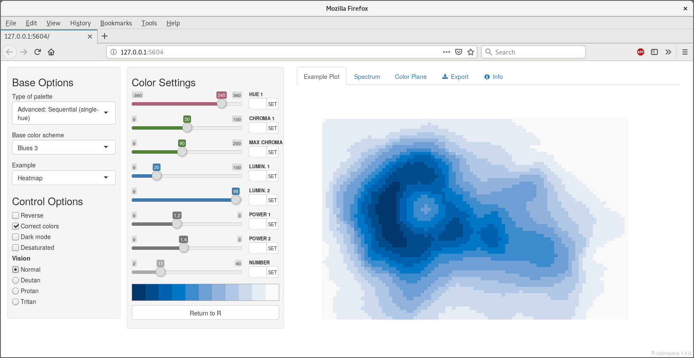

---
author:
  - name: Achim Zeileis
    # primary affiliation
    affiliation: Universität Innsbruck
    # full address
    address: |
      | Department of Statistics
      | Faculty of Economics and Statistics
      | Universitätsstr. 15
      | 6020 Innsbruck, Austria
    email: \email{Achim.Zeileis@R-project.org}
    url: https://eeecon.uibk.ac.at/~zeileis/
  - name: Jason C. Fisher
    affiliation: U.S. Geological Survey
  - name: Kurt Hornik
    affiliation: |
      | WU Wirtschafts-
      | universität Wien
  - name: Ross Ihaka
    affiliation: University of Auckland \AND
  - name: Claire D. McWhite
    affiliation: |
      | The University of
      | Texas at Austin
  - name: Paul Murrell
    affiliation: University of Auckland
  - name: Reto Stauffer
    affiliation: Universität Innsbruck
  - name: Claus O. Wilke
    affiliation: |
      | The University of
      | Texas at Austin
title:
  # title in title case
  formatted: "\\pkg{colorspace}: A Toolbox for Manipulating and Assessing Colors and Palettes"
  # without LaTeX markup (if any)
  plain:     "colorspace: A Toolbox for Manipulating and Assessing Colors and Palettes"
  # with LaTeX markup (if any), used as running title
  short:     "\\pkg{colorspace}: Manipulating and Assessing Colors and Palettes"
abstract: >
  The \proglang{R} package \pkg{colorspace} provides a
  flexible toolbox for selecting individual colors or color palettes, manipulating
  these colors, and employing them in statistical graphics and data
  visualizations. In particular, the package provides a broad range of color
  palettes based on the HCL (Hue-Chroma-Luminance) color space. The three HCL
  dimensions have been shown to match those of the human visual system very well,
  thus facilitating intuitive selection of color palettes through trajectories in
  this space.  

  Namely, general strategies for three types of palettes are provided:
  (1)\ Qualitative for coding categorical information, i.e., where no particular
  ordering of categories is available. (2)\ Sequential for coding ordered/numeric information, i.e.,
  going from high to low (or vice versa). (3)\ Diverging for coding ordered/numeric
  information around a central neutral value, i.e., where colors diverge from
  neutral to two extremes.  

  To aid selection and application of these palettes the package provides scales
  for use with \pkg{ggplot2}, \pkg{shiny} (and \pkg{tcltk}) apps for interactive
  exploration, visualizations of palette properties,
  accompanying manipulation utilities (like desaturation and lighten/darken), and
  emulation of color vision deficiencies.
keywords:
  # at least one keyword, comma-separated and in sentence case
  formatted: [color, palette, HCL, RGB, hue, color vision deficiency, "\\proglang{R}"]
  plain:     [color, palette, HCL, RGB, hue, color vision deficiency, R]
preamble: >
  \usepackage{thumbpdf,lmodern}
  \usepackage{booktabs,amsmath,longtable,supertabular,framed}
  \newcommand{\tex}[1]{#1}
output: rticles::jss_article
bibliography: ../../vignettes/color.bib
---

\tex{\vspace*{-0.4cm}}

# Introduction {#sec:intro}

The \pkg{colorspace} package provides a broad toolbox for selecting individual
colors or color palettes, manipulating these colors, and employing
them in various kinds of visualizations.


```{r preliminaries, echo = FALSE, message = FALSE}
library("colorspace")
library("ggplot2")
theme_set(theme_minimal())
knitr::opts_chunk$set(message = FALSE, warning = FALSE,
  dev = "pdf", dpi = 150, out.width = "\\textwidth", fig.cap = "FIXME.",
  fig.height = 6, fig.width = 6, fig.pos = "t!",
  fig.align = "center", fig.show = "hold", fig.path = "Figures/")
```

At the core of the package there are various utilities for computing with
color spaces (as the name conveys). Thus, the package helps to map various three-dimensional
representations of color to each other. A particularly important
mapping is the one from the perceptually-based and device-independent color model
HCL (Hue-Chroma-Luminance) to standard Red-Green-Blue (sRGB) which is the basis for color
specifications in many systems based on the corresponding hex codes (e.g., in HTML but also
in \proglang{R}). For completeness further standard color models are included as well in the package:
`polarLUV()` (= HCL), `LUV()`, `polarLAB()`, `LAB()`, `XYZ()`, `RGB()`, `sRGB()`, `HLS()`,
`HSV()`.

The HCL space (= polar coordinates in CIELUV) is particularly useful for
specifying individual colors and color palettes as its three axes match those
of the human visual system very well: Hue (= type of color, dominant wavelength),
chroma (= colorfulness), luminance (= brightness), see Figure\ \ref{fig:hcl-properties}.

```{r hcl-properties, echo = FALSE, fig.width = 4, fig.height = 2.2, out.width = "0.5\\textwidth", fig.cap = "Axes of the HCL color space. Top: Hue $H$ changes from 0 (red) via 60 (yellow), etc.\\ to 300 (purple) with fixed $C = 60$ and $L = 65$. Center: Chroma $C$ changes from 0 (gray) to 100 (colorful) with fixed $H = 0$ (red) and $L = 65$. Bottom: Luminance $L$ changes from 90 (light) to 25 (dark) with fixed $H = 260$ (blue) and $C = 25$ (low, close to gray)."}
swatchplot(
  "Hue\n(Type of color)"       = sequential_hcl(5, h = c(0, 300), c = c(60, 60), l = 65),
  "Chroma\n(Colorfulness)"    = sequential_hcl(5, h = 0, c = c(100, 0), l = 65, rev = TRUE, power = 1),
  "Luminance\n(Brightness)" = sequential_hcl(5, h = 260, c = c(25, 25), l = c(25, 90), rev = TRUE, power = 1),
  nrow = 3, line = 5.2, off = 0
)
```

The \pkg{colorspace} package provides three types of palettes based on the HCL model:

* _Qualitative:_ Designed for coding categorical information, i.e.,
  where no particular ordering of categories is available and every color
  should receive the same perceptual weight. Function: `qualitative_hcl()`.
* _Sequential:_ Designed for coding ordered/numeric information, i.e.,
  where colors go from high to low (or vice versa). Function: `sequential_hcl()`.
* _Diverging:_ Designed for coding ordered/numeric information around a central
  neutral value, i.e., where colors diverge from neutral to two extremes.
  Function: `diverging_hcl()`.

To aid choice and application of these palettes there are: scales for use
with \pkg{ggplot2} [@color:ggplot2]; \pkg{shiny} [@color:shiny] [and \pkg{tcltk}, @color:R] apps for interactive exploration;
visualizations of palette properties; accompanying manipulation utilities
(like desaturation, lighten/darken, and emulation of color vision deficiencies).


FIXME: More comparison with/discussion of other palette packages.
the viridis palettes of @color:Smith+VanDerWalt:2015 developed for \pkg{matplotlib},
as provided by \proglang{R} package \pkg{viridis} [@color:viridis], and
the scientific color maps of @color:Crameri:2018 as provided by \proglang{R}
package \pkg{scico} [@color:scico]. All yield mostly well-balanced color palettes
and can be approximated reasonably well in \pkg{colorspace}
(see Section\ \ref{sec:approximations}).
A broad range of packages that provide color palettes that are "in harmony" as
they are extracted and clustered from movies, paintings, etc. However, many of these
are not so suitable for scientific visualization as they are not clearly 
qualitative/sequential/diverging. An influential package following such an
approach is \pkg{wesanderson} [@color:wesanderson]. The \pkg{paletteer}
[@color:paletteer] package aggregates these and provides them in a unified
user interface.
Aims of code in \pkg{colorspace} are general trajectories, adaptable HCL
coordinates, along with visualization and assessment of palettes (beyond
color swatches).


# A quick tour {#sec:tour}

The stable release version of \pkg{colorspace} is hosted on the Comprehensive \proglang{R} Archive Network
(CRAN) at <https://CRAN.R-project.org/package=colorspace> and the development version of \pkg{colorspace}
is hosted on \proglang{R}-Forge at \url{https://R-Forge.R-project.org/projects/colorspace/}.


## Choosing HCL-based color palettes

The \pkg{colorspace} package ships with a wide range of predefined color palettes,
specified through suitable trajectories in the HCL (hue-chroma-luminance) color space.
A quick overview can be gained easily with the `hcl_palettes()` function (see Figure\ \ref{fig:hcl-palettes}):

```{r hcl-palettes, fig.height = 6.75, fig.width = 12, fig.cap = "Overview of available predefined palettes in \\pkg{colorspace}."}
library("colorspace")
hcl_palettes(plot = TRUE)
```

A suitable vector of colors can be easily computed by specifying the desired number
of colors and palette name (see Figure\ \ref{fig:hcl-palettes} for possible palette names), e.g.,

```{r qualitative-hcl-4}
q4 <- qualitative_hcl(4, palette = "Dark 3")
q4
```

The functions `sequential_hcl()`, and `diverging_hcl()` work analogously. Additionally,
a palette's hue/chroma/luminance parameters can be modified, thus allowing to easily customize
each palette. Moreover, the `choose_palette()`/`hclwizard()` app provides convenient user
interfaces to perform palette customization interactively. Finally, even more flexible diverging
HCL palettes are provided by `divergingx_hcl()`.


## Usage with base graphics

The color vectors returned by the HCL palette functions can usually be passed directly
to most base graphics function, typically through the `col` argument. Here, the `q4`
vector created above is used in a time series display (see the left panel of
Figure\ \ref{fig:eustockmarkets-titanic}):

```{r eustockmarkets, eval = FALSE}
plot(log(EuStockMarkets), plot.type = "single", col = q4, lwd = 2)
legend("topleft", colnames(EuStockMarkets), col = q4, lwd = 3, bty = "n")
```

As another example for a sequential palette a spine plot is created (see the right
panel of Figure\ \ref{fig:eustockmarkets-titanic}),
displaying the proportion of Titanic passengers that survived per class.
The `"Purples 3"` palette is used which is quite similar to the \pkg{ColorBrewer.org}
[@color:Harrower+Brewer:2003] palette `"Purples"`. Here, only two colors are
employed, yielding a dark purple and light gray.

```{r titanic, eval = FALSE}
ttnc <- margin.table(Titanic, c(1, 4))[, 2:1]
spineplot(ttnc, col = sequential_hcl(2, palette = "Purples 3"))
```

```{r eustockmarkets-titanic, echo = FALSE, fig.height = 4, fig.width = 10, fig.cap = "Using \\pkg{colorspace} with base \\proglang{R} graphics. Left: Time series plot of log-prices from \\code{EuStockMarkets} data with \\code{qualitative\\_hcl(4, \"Dark 3\")} palette. Right: Spine plot with survival proportions across passenger classes in the \\code{titanice} data with \\code{sequential\\_hcl(2, \"Purples 3\")} palette."}
par(mar = c(5, 4, 1, 2), mfrow = c(1, 2))
plot(log(EuStockMarkets), plot.type = "single", col = q4, lwd = 2)
legend("topleft", colnames(EuStockMarkets), col = q4, lwd = 3, bty = "n")
ttnc <- margin.table(Titanic, c(1, 4))[, 2:1]
spineplot(ttnc, col = sequential_hcl(2, "Purples 3"))
```


## Usage with ggplot2 {#sec:ggplot2}

To plug the HCL color palettes into \pkg{ggplot2} graphics [@color:ggplot2; @color:ggplot2pkg]
suitable discrete and/or continuous \pkg{gglot2} color scales are provided.
The scales are called via the scheme

    scale_<aesthetic>_<datatype>_<colorscale>()
    
where

- `<aesthetic>` is the name of the aesthetic (`fill`, `color`, `colour`).
- `<datatype>` is the type of the variable plotted (`discrete` or `continuous`).
- `<colorscale>` sets the type of the color scale used (`qualitative`, `sequential`, `diverging`, `divergingx`).

To illustrate their usage two simple examples are shown using the qualitative `"Dark 3"`
and sequential `"Purples 3"` palettes that were also employed above
(see Figure\ \ref{fig:iris-diamonds}). For the first example, semi-transparent
shaded densities of the sepal length from the `iris` data are shown, grouped by species
 (see the left panel of Figure\ \ref{fig:iris-ggplot}).

```{r iris-ggplot, eval = FALSE}
library("ggplot2")
ggplot(iris, aes(x = Sepal.Length, fill = Species)) +
  geom_density(alpha = 0.6) +
  scale_fill_discrete_qualitative(palette = "Dark 3")
```

And for the second example the sequential palette is used to code the cut levels
in a scatter of price by carat in the `diamonds` data (or rather a small subsample
thereof, see the right panel of Figure\ \ref{fig:iris-ggplot}). The scale function first
generates six colors but then drops the first color because the light gray is too light
here. (Alternatively, the chroma and luminance parameters could also be tweaked.)

```{r diamonds-ggplot, eval = FALSE}
dsamp <- diamonds[1 + 1:1000 * 50, ]
ggplot(dsamp, aes(carat, price, color = cut)) + geom_point() +
  scale_color_discrete_sequential(palette = "Purples 3",
    nmax = 6, order = 2:6)
```

```{r iris-diamonds, echo = FALSE, fig.height = 4, fig.width = 5, out.width = "0.49\\textwidth", fig.cap = "Using \\pkg{colorspace} with \\pkg{ggplot2} graphics. Left: Kernel density of sepal length, grouped and shaded by species, in the \\code{iris} data with semi-transparent \\code{scale\\_fill\\_discrete\\_qualitative(palette = \"Dark 3\")} color scale. Right: Scatter plot of price by carat, shaded by cut levels, in a subsample of the \\code{diamonds} data with the \\code{scale\\_color\\_discrete\\_sequential(palette = \"Purples 3\", nmax = 6, order = 2:6)} color scale."}
library("ggplot2")
ggplot(iris, aes(x = Sepal.Length, fill = Species)) + geom_density(alpha = 0.6) +
  scale_fill_discrete_qualitative(palette = "Dark 3")
set.seed(1)
dsamp <- diamonds[1 + 1:1000 * 50, ]
ggplot(dsamp, aes(carat, price, color = cut)) + geom_point() +
  scale_color_discrete_sequential(palette = "Purples 3", nmax = 6, order = 2:6)
```


## Palette visualization and assessment

The \pkg{colorspace} package also provides a number of functions that aid visualization and
assessment of its palettes.

* `demoplot()` can display a palette (with arbitrary number of colors) in a range of
  typical and somewhat simplified statistical graphics.
* `hclplot()` converts the colors of a palette to the corresponding hue/chroma/luminance
  coordinates and displays them in HCL space with one dimension collapsed. The collapsed
  dimension is the luminance for qualitative palettes and the hue for sequential/diverging palettes.
* `specplot()` also converts the colors to hue/chroma/luminance coordinates but draws
  the resulting spectrum in a line plot.

For the qualitative `"Dark 3"` palette from above the following plots can be obtained
(see Figure\ \ref{fig:allplots-qualitative}).

```{r visualiation-qualitative, eval = FALSE}
demoplot(q4, "bar")
hclplot(q4)
specplot(q4, type = "o")
```

```{r allplots-qualitative, echo = FALSE, fig.height = 4.5, fig.width = 14, dev = "png", fig.cap = "Palette visualization and assessment for \\code{qualitative\\_hcl(4, \"Dark 3\")} palette. Left: Demo bar plot. Center: Hue-chroma plane at fixed $L = 60$ in HCL space. Right: HCL spectrum with linearly changing hue (around color wheel), almost constant chroma, and constant luminance."}
allplots <- function(palette, ...) {
  layout(cbind(1, 2, 3:4), heights = c(2, 10))
  par(oma = c(2, 5, 2, 3), mar = rep(0.5, 4))
  demoplot(palette, ...)
  hclplot(palette)
  par(xaxt = "n", yaxt = "n", mar = c(0.2, 3, 0.2, 0), cex = 1)
  image(matrix(seq_along(palette), ncol = 1L), col = palette)
  par(yaxt = "s")
  specplot(palette, type = "o", palette = FALSE, oma = FALSE, mar = c(0.2, 3, 0.2, 0))
}
allplots(q4, "bar")
```

The bar plot is used as a typical application for a qualitative palette (in addition to the
time series and density plots used above). The other two displays show that luminance
is (almost) constant in the palette while the hue changes linearly along the color
"wheel". Ideally, chroma would have also been constant to completely balance the colors.
However, at this luminance the maximum chroma differs across hues so that the palette
is fixed up to use less chroma for the yellow and green elements.

Note also that in a bar plot areas are shaded (and not just points or lines) so that
lighter colors would be preferable. In the density plot in Figure\ \ref{fig:iris-diamonds}
this was achieved through semi-transparency. Alternatively, luminance could be increased
as is done in the `"Pastel 1"` or `"Set 3"` palettes.

Subsequently, the same types of assessment are carried out in Figure\ \ref{fig:allplots-sequential}
for the sequential `"Purples 3"` palette as employed above. 

```{r visualization-sequential, eval = FALSE}
s9 <- sequential_hcl(9, "Purples 3")
demoplot(s9, "heatmap")
hclplot(s9)
specplot(s9, type = "o")
```

```{r allplots-sequential, echo = FALSE, fig.height = 4.5, fig.width = 14, dev = "png", fig.cap = "Palette visualization and assessment for \\code{sequential\\_hcl(4, \"Purples 3\")} palette. Left: Demo heatmap. Center: Chroma-luminance plane at fixed $H = 270$ in HCL space. Right: HCL spectrum with constant hue, triangular chroma, and increasting luminance."}
s9 <- sequential_hcl(9, "Purples 3")
allplots(s9, "heatmap")
```

In Figure\ \ref{fig:applots-sequential}, a heatmap (based on the well-known Maunga Whau volcano data) is used as a typical
application for a sequential palette. The elevation of the volcano is brought out clearly,
focusing with the dark colors on the higher elevations.
The other two displays show that hue is constant in the palette while luminance and chroma vary.
Luminance increases monotonically from dark to light (as required for a proper sequential palette).
Chroma is triangular-shaped which allows to better distinguish the middle colors in the palette
when compared to a monotonic chroma trajectory.


# Color spaces: S4 classes and utilities  {#sec:color_spaces}

```{r color-spaces, fig.width = 9.5, fig.height = 4.5, echo = FALSE, out.width = "0.9\\textwidth", fig.cap = "Relationship between three-dimensional color spaces implemented in \\pkg{colorspace}. Color models that are (or try to be) perceptually-based are displayed with circles, other color models with rectangles."}
par(mar = rep(0, 4))

d <- data.frame(
  x = c(1, 1, 2, 2, 3, 4, 5, 5, 5, 6),
  y = c(1, 3, 1, 3, 2, 2, 1, 3, 2, 2),
  lab = c("polarLAB", "polarLUV\n(= HCL)", "LAB", "LUV", "XYZ", "RGB", "HLS", "HSV", "sRGB", "hex"),
  stringsAsFactors = FALSE
)

plot(0, 0, type = "n", axes = FALSE, xlab = "", ylab = "",
  xlim = c(0.7, 6.3), ylim = c(0.4, 3.6))
lines(y ~ x, data = d[-c(1, 3, 7, 8),])
lines(y ~ x, data = d[c(1, 3, 5),])
lines(y ~ x, data = d[c(6, 7, 9),])
lines(y ~ x, data = d[c(6, 8, 9),])
points(y ~ x, data = d[c(1, 2, 7, 8), ], pch = 21, bg = "lightgray", cex = 12)
points(y ~ x, data = d[c(3, 4, 5, 6, 9), ], pch = 22, bg = "lightgray", cex = 12)
points(y ~ x, data = d[10, ], pch = 23, bg = "white", cex = 12)

text(d$x, d$y, d$lab)
text(3.5, 2, "white point\n= D65", cex = 0.7, pos = 3)
text(4.56, 2, "gamma\n(= 2.4)", cex = 0.7, pos = 3)
```

At the core of the \pkg{colorspace} package are various utilities for computing with
color spaces (as the name conveys). Thus, the package helps to map various three-dimensional
representations of color to each other [@color:Ihaka:2003]. A particularly important
mapping is the one from the perceptually-based and device-independent color model
HCL (Hue-Chroma-Luminance) to standard Red-Green-Blue (sRGB) which is the basis for color
specifications in many systems based on the corresponding hex codes (e.g., in HTML but also
in \proglang{R}). For completeness further standard color models are included as well in the package.
The connections are illustrated in Figure\ \ref{fig:color-spaces}.
Color models that are (or try to be) perceptually-based are displayed with circles
and models that are not are displayed with rectangles.

## Implemented color spaces

The color spaces, implemented in \pkg{colorspace}, along with corresponding \proglang{S}4 classes
and eponymous class constructors are:

* `RGB()` for the classic Red-Green-Blue color model that mixes three primary colors
  with different intensities to obtain a spectrum of colors. The advantage of this
  color model is (or was) that it corresponded to how computer and TV screens generated
  colors, hence it was widely adopted and still is the basis for color specifications
  in many systems. For example, the hex color codes are employed in HTML but also in \proglang{R}.
  However, the RGB model also has some important drawbacks: It does not take into
  account the output device properties, it is not perceptually uniform (a unit step
  within RGB does not produce a constant perceptual change in color), and it is
  unintuitive for humans to specify colors (say brown or pink) in this space.
  See @color:Wiki+RGB for more details.
* `sRGB()` addresses the issue of device dependency by adopting a so-called gamma
  correction. Therefore, the gamma-corrected standard RGB (sRGB), as opposed to the
  linearized RGB above, is a good model for specifying colors in software and for
  hardware. But it is still unintuitive for humans to work directly with this.
  Therefore, sRGB is a good place to end up in a color space manipulation but
  it is not a good place to start. See @color:Wiki+sRGB for more details.
* `HSV()` is a simple transformation of the (s)RGB space that tries to capture the
  perceptual axes: _hue_ (dominant wavelength, the type of color), _saturation_
  (colorfulness), and _value_ (brightness, i.e., light vs.\ dark). Unfortunately,
  the three axes in the HSV model are confounded so that, e.g., brightness changes
  dramaticaly with hue.
  See @color:Wiki+HSV for more details.
* `HLS()` (Hue-Lightness-Saturation) is another transformation of (s)RGB that tries
  to capture the perceptual axes. It does a somewhat better job but the dimensions
  are still strongly confounded.
  See @color:Wiki+HSV for more details.
* `XYZ()` was established by the CIE (Commission Internationale de l'Eclairage)
  based on psychophysical experiments with human subjects. It provides a unique triplet of
  XYZ values, coding the standard observer's perception of the color. It is
  device-independent but it is not perceptually uniform and the XYZ coordinates
  have no intuitive meaning.
  See @color:Wiki+CIEXYZ for more details.
* `LUV()` and `LAB()` were therefore proposed by the CIE as perceptually uniform
  color spaces where the former is typically preferred for emissive technologies
  (such as screens and monitors) whereas the latter is usually preferred when
  working with dyes and pigments. However, the three axes of these two spaces
  still do not correspond to human perceptual axes.
  See @color:Wiki+CIELUV; @color:Wiki+CIELAB for more details.
* `polarLUV()` and `polarLAB()` therefore take polar coordinates in the UV plane
  and AB plane, respectively. Specifically, the polar coordinates of the LUV
  model are known as the HCL (Hue-Chroma-Luminance) model. These capture the
  human perceptual axes very well without confounding effects as in the HSV or
  HLS approaches. (More details follow below.)

All the \proglang{S}4 classes listed above inherit from a virtual class `color` which are
internally always represented by matrices with three columns (corresponding to
the different three dimensions).

Note that since the inception of the color space conversion tools within \pkg{colorspace}'s
\proglang{C} code by @color:Ihaka:2003 other \proglang{R} tools for this purpose became available.
Notably, base \proglang{R} meanwhile provides `grDevices::convertColor()`
[computed in high-level \proglang{R}, @color:R] and
`farver::convert_colour()` [@color:farver] is based on a \proglang{C++} library. For many basic color
conversion purposes the \pkg{colorspace} package and these alternatives are essentially equally suitable,
though [see the discussion in @color:convertColor]. Moreover, base \proglang{R} also provides
`grDevices::hcl()` for mapping HCL representations to hex codes.

To make the \pkg{colorspace} package self-contained and exactly backward compatible, the \proglang{C}
code in \pkg{colorspace} is still used as the basis for all color space conversions.


## Utilities

For working with the implemented \proglang{S}4 color spaces various utilities are available:

* `as()` method: Conversions of a `color` object to the various color spaces,
  e.g., `as(x, "sRGB")`.
* `coords()`: Extract the three-dimensional coordinates pertaining to the current
  color class.
* `hex()`: Convert a color object to sRGB and code in a hex string that can be
  used within \proglang{R} plotting functions.
* `hex2RGB()`: Convert a given hex color string to an sRGB color object which
  can also be coerced to other color spaces.
* `readRGB()` and `readhex()` can read text files into color objects, either
  from RGB coordinates or hex color strings.
* `writehex()`: Writes hex color strings to a text file.
* `whitepoint()`: Query and change the white point employed in conversions
  from CIE XYZ to RGB. Defaults to D65.


## Illustration of basic colorspace functionality

As an example a vector of colors `x` can be specified in the HCL (or polar LUV) model:

```{r polarLUV}
(x <- polarLUV(L = 70, C = 50, H = c(0, 120, 240)))
```

The resulting three colors are pastel red (hue = 0), green (hue = 120), and blue (hue = 240) with moderate chroma and luminance.
For display in other systems an sRGB representation might be needed:

```{r sRGB}
(y <- as(x, "sRGB"))
```

With `coords(x)` or `coords(y)` the displayed coordinates can also be extracted
as numeric matrices. And from sRGB we can also coerce to HSV for example:

```{r HSV}
as(y, "HSV")
```

For display in many systems (including \proglang{R} itself) hex color codes based on the
sRGB coordinates can be created:

```{r hex}
hex(x)
```


# HCL-based color palettes {#sec:hcl_palettes}

As motivated in the previous section,
the HCL space is particularly useful for specifying individual colors and color palettes as its three axes match those
of the human visual system very well. Therefore, the \pkg{colorspace} package provides
three palette functions based on the HCL model: `qualitative_hcl()`, `sequential_hcl()`,
and `diverging_hcl()`. Their construction principles are exemplified in
Figure\ \ref{fig:hcl-palettes-principles} and explained in more detail below. The desaturated
palettes in the second row of Figure\ \ref{fig:hcl-palettes-principles}
bring out clearly that luminance differences (= light-dark contrasts)
are crucial for sequential and diverging palettes while qualitative palettes
are balanced at the same luminance.

```{r hcl-palettes-principles, echo = FALSE, fig.width = 12, fig.height = 1.6, fig.cap = "Examples of palette types in \\pkg{colorspace}. Qualitative palettes are balanced towards the same luminance level while sequential and diverging palettes go from dark to light and/or vice versa, respectively."}
swatchplot(
  "Qualitative (Set 2)"     = rbind("Color" = qualitative_hcl(5, "Set 2"),     "Desaturated" = desaturate(qualitative_hcl(5, "Set 2"))),
  "Sequential (Blues 3)"    = rbind("Color" = sequential_hcl(7, "Blues 3"),    "Desaturated" = desaturate(sequential_hcl(7, "Blues 3"))),
  "Diverging (Green-Brown)" = rbind("Color" = diverging_hcl(7, "Green-Brown"), "Desaturated" = desaturate(diverging_hcl(7, "Green-Brown"))),
  nrow = 3, line = 7)
```

To facilitate obtaining good sets of colors, HCL parameter combinations that yield
useful palettes are accessible by name. These can be listed using the function
`hcl_palettes()`:

```{r hcl-palettes-print}
hcl_palettes()
```

To inspect the HCL parameter combinations for a specific palette simply include the `palette` name
where upper- vs.\ lower-case, spaces, etc.\ are ignored for matching the label, i.e.,
`"set2"` matches `"Set 2"`:

```{r hcl-palette}
hcl_palettes(palette = "set2")
```

To compute the actual color hex codes (representing sRGB coordinates) based on these HCL parameters, the functions
`qualitative_hcl()`, `sequential_hcl()`, and `diverging_hcl()` can be used.
Either all parameters can be specified "by hand" through the HCL parameters, an entire
palette can be specified "by name", or the name-based specification can be modified by a
few HCL parameters. In case of the HCL parameters, either a vector-based specification
such as `h = c(0, 270)` or individual parameters `h1 = 0` and `h2 = 270`
can be used.

The first three of the following commands lead to equivalent output. The fourth command
yields a modified set of colors (lighter due to a luminance of 80 instead of 70).

```{r qualitative-hcl}
qualitative_hcl(4, h = c(0, 270), c = 60, l = 70)
qualitative_hcl(4, h1 = 0, h2 = 270, c1 = 60, l1 = 70)
qualitative_hcl(4, palette = "set2")
qualitative_hcl(4, palette = "set2", l = 80)
```

## Qualitative palettes

As suggested by @color:Ihaka:2003 `qualitative_hcl()` distinguishes the underlying categories by a sequence of
hues while keeping both chroma and luminance constant to give each color in the
resulting palette the same perceptual weight. Thus, `h` should be a pair of
hues (or equivalently `h1` and `h2` can be used) with the starting and
ending hue of the palette. Then, an equidistant sequence between these hues is
employed, by default spanning the full color wheel (i.e., the full 360 degrees).
Chroma `c` (or equivalently `c1`) and luminance `l` (or equivalently
`l1`) are constants.

Figure\ \ref{fig:hcl-palettes-qualitative} shows the named palettes available in the
`qualitative_hcl()` function. The first five
palettes are close to the \pkg{ColorBrewer.org} palettes of the same name [@color:Harrower+Brewer:2003].
They employ different levels of chroma and luminance and, by default, span the full
hue range. The remaining four palettes are taken from @color:Ihaka:2003. They are
based on the same chroma (= 50) and luminance (= 70) but the hue is restricted to
different intervals.

```{r hcl-palettes-qualitative, fig.width = 8.0, fig.height = 2.5, out.width = "0.8\\textwidth", fig.cap = "Prespecified qualitative HCL palettes available in \\code{qualitative\\_hcl()} in \\pkg{colorspace}."}
hcl_palettes("qualitative", plot = TRUE, nrow = 5)
```

When qualtitative palettes are employed for shading areas in statistical displays
(e.g., in bar plots, pie charts, or regions in maps), then it is typically
less distracting to use lighter colors (with moderate chroma and high luminance)
such as `"Pastel 1"` or `"Set 3"`. When coloring points or lines then more flashy
colors (with high chroma) are often required: On a white background a moderate
luminance as in `"Dark 2"` or `"Dark 3"` usually works better while on a black/dark
background the luminance should be higher as in `"Set 2"`.
Some examples with demo graphics are provided in Section\ \ref{sec:palette_visualization}.

## Sequential palettes (single-hue)

As suggested by @color:Zeileis+Hornik+Murrell:2009 `sequential_hcl()` codes the underlying numeric values by a monotonic sequence
of increasing (or decreasing) luminance. Thus, the function's `l` argument should provide
a vector of length 2 with starting and ending luminance (equivalently, `l1` and
`l2` can be used). Without chroma (i.e., `c = 0`), this simply corresponds
to a grayscale palette like `gray.colors()`, see `"Grays"` and `"Light Grays"`
in Figure\ \ref{fig:hcl-palettes-sequentials}.

For adding chroma, a simple strategy would be to pick a single hue (via `h` or `h1`)
and then decrease chroma from some value (`c` or `c1`) to zero (i.e., gray) along with
increasing luminance. For bringing out the extremes (a dark high-chroma color vs.\ a
light gray) this is already very effective, see `"Blues 2"`, `"Purples 2"`, `"Reds 2"`,
and `"Greens 2"`.

For distinguishing colors in the middle, two strategies can be employed:
(a) Hue can be varied as well by specifying an interval of hues in `h` (or beginning
hue `h1` and ending hue `h2`). More details are provided in the next section.
(b) Instead of a decreasing chroma a triangular chroma trajectory can be employed
from `c1` over `cmax` to `c2` (or equivalently a vector `c` of
length 3). This yields high-chroma colors in the middle of the palette that are
more easily distinguished from the dark and light extremes. See `"Blues 3"`, `"Purples 3"`,
`"Reds 3"`, and `"Greens 3"` in Figure\ \ref{fig:hcl-palettes-sequentials}.

Instead of employing linear trajectories in the chroma or luminance coordinates,
some palettes employ a power transformation of the chroma and/or luminance
trajectory. Either a vector `power` of length 2 or separate `p1` (for chroma)
and `p2` (for luminance) can be specified. If missing, the latter defaults to the
former.

```{r hcl-palettes-sequentials, fig.width = 8.0, fig.height = 3.0, out.width = "0.8\\textwidth", fig.cap = "Prespecified sequential single-hue HCL palettes available in \\code{sequential\\_hcl()} in \\pkg{colorspace}."}
hcl_palettes("sequential (single-hue)", n = 7, plot = TRUE, nrow = 6)
```

All except the last palette are inspired by the \pkg{ColorBrewer.org} palettes with
the same base name [@color:Harrower+Brewer:2003] but restricted to a single hue only.
They are intended for a white/light background. The last palette (`"Oslo"`) is taken from
the scientific color maps of @color:Crameri:2018 and is intended for a black/dark
background and hence the order is reversed starting from a light blue (not a light gray).

To distinguish many colors in a sequential palette it is important to have a strong
contrast on the luminance axis, possibly enhanced by an accompanying pronounced
variation in chroma. When only a few colors are needed (e.g., for coding an ordinal
categorical variable with few levels) then a lower luminance contrast may suffice.


## Sequential palettes (multi-hue)

To not only bring out extreme colors in a sequential palette but also better distinguish
middle colors it is a common strategy to employ a sequence of hues. Thus, the basis
of such a palette is still a monotonic luminance sequence as above (combined with a
monotonic or triangular chroma sequence). But rather than using a single hue, an interval
of hues in `h` (or beginning hue `h1` and ending hue `h2`) can be specified.

`sequential_hcl()` allows combined variations in hue (`h` and `h1`/`h2`, respectively),
chroma (`c` and `c1`/`c2`/`cmax`, respectively),
luminance (`l` and `l1`/`l2`, respectively), and
power transformations for the chroma and luminance trajectories
(`power` and `p1`/`p2`, respectively). This yields a broad variety of sequential
palettes, including many that closely match other well-known color palettes.
Figure\ \ref{fig:hcl-palettes-sequentialm} shows all the named multi-hue sequential palettes in \pkg{colorspace}:

```{r hcl-palettes-sequentialm, fig.width = 8.5, fig.height = 9.0, fig.cap = "Prespecified sequential multi-hue HCL palettes available in \\code{sequential\\_hcl()} in \\pkg{colorspace}."}
hcl_palettes("sequential (multi-hue)", n = 7, plot = TRUE)
```

* `"Purple-Blue"` to `"Terrain 2"` are various palettes created during the development
  of \pkg{colorspace}, e.g., by @color:Zeileis+Hornik+Murrell:2009 or @color:Stauffer+Mayr+Dabernig:2015
  among others.
* `"Viridis"` to `"Inferno"` closely match the palettes that @color:Smith+VanDerWalt:2015
  developed for \pkg{matplotlib} and that gained popularity recently.
* `"Dark Mint"` to `"BrwnYl"` closely match palettes provided in \pkg{CARTO} [@color:CARTO].
* `"YlOrRd"` to `"Blues"` closely match \pkg{ColorBrewer.org} palettes [@color:Harrower+Brewer:2003].
* `"Lajolla"` and `"Turku"` closely match the scientific color maps of the same name by
  @color:Crameri:2018 and are intended for a black/dark background.

Note that the palettes differ substantially in the amount of chroma and luminance
contrasts, respectively. For example, many palettes go from a dark high-chroma color
to a neutral low-chroma color (e.g., `"Reds"`, `"Purples"`, `"Greens"`, `"Blues"`) or even
light gray (e.g., `"Purple-Blue"`). But some palettes also employ relatively high chroma
throughout the palette (e.g., the viridis and many \pkg{CARTO} palettes). To emphasize
the extremes the former strategy is typically more suitable while the latter works
better if all values along the sequence should receive some more perceptual weight.


## Diverging palettes

`diverging_hcl()` codes the underlying numeric values by a triangular luminance
sequence with different hues in the left and in the right "arm" of the palette. Thus,
it can be seen as a combination of two sequential palettes with some restrictions:
(a) a single hue is used for each arm of the palette, (b) chroma and luminance trajectory
are balanced between the two arms, (c) the neutral central value has zero chroma.
To specify such a palette a vector of two hues `h` (or equivalently `h1`
and `h2`), either a single chroma value `c` (or `c1`) or a vector
of two chroma values `c` (or `c1` and `cmax`), a vector of two
luminances `l` (or `l1` and `l2`), and power parameter(s) `power`
(or `p1` and `p2`) are used. For more flexible diverging palettes without
the restrictrictions above (and consequently more parameters) see the `divergingx_hcl()`
palettes introduced below.

Figure\ \ref{fig:hcl-palettes-diverging} shows all such diverging palettes that have been named in \pkg{colorspace}:

```{r hcl-palettes-diverging, fig.width = 8.0, fig.height = 4.75, out.width = "0.8\\textwidth", fig.cap = "Prespecified diverging HCL palettes available in \\code{diverging\\_hcl()} in \\pkg{colorspace}."}
hcl_palettes("diverging", n = 7, plot = TRUE, nrow = 10)
```

* `"Blue-Red"` to `"Cyan-Magenta"` have been developed for \pkg{colorspace} starting from
  @color:Zeileis+Hornik+Murrell:2009, taking inspiration from various other palettes,
  including more balanced and simplified versions of several \pkg{ColorBrewer.org}
  palettes [@color:Harrower+Brewer:2003].
* `"Tropic"` closely matches the palette of the same name from \pkg{CARTO} [@color:CARTO].
* `"Broc"` to `"Vik"` and `"Berlin"` to `"Tofino"` closely match the scientific color maps of the same name by
  @color:Crameri:2018, where the first three are intended for a white/light background and
  the other three for a black/dark background.

When choosing a particular palette for a display similar considerations apply as
for the sequential palettes. Thus, large luminance differences are important when
many colors are used while smaller luminance contrasts may suffice for palettes with
fewer colors etc.


## Construction details

Table\ \ref{tab:hcl} summarizes which types of trajectories (_constant_, _linear_, _triangular_)
are used for the three HCL coordinates (hue _H_, chroma _C_, luminance _L_) to construct
the different types of palettes (_qualitative_, _sequential_, and _diverging_).

\begin{table}[t!]
\centering
\begin{tabular}{llll}
\hline
Type          & $H$                               & $C$                        & $L$              \\ \hline
Qualitative   & Linear  		          & Constant	               & Constant	  \\
Sequential    & Constant (= single-hue) \emph{or} & Linear (+ power) \emph{or} & Linear (+ power) \\
	      & Linear (= multi-hue)	          & Triangular (+ power)       & 		  \\
Diverging     & Constant ($2\times$)	          & Linear (+ power) \emph{or} & Linear (+ power) \\
	      & 			          & Triangular (+ power)       & 		  \\
\hline
\end{tabular}
\caption{\label{tab:hcl} Types of trajectories used for the HCL coordinates to construct qualitative,
sequential, and diverging palettes, see Equations~\ref{eq:constant}--\ref{eq:triangular}.}
\end{table}

As emphasized in Figure\ \ref{fig:hcl-palettes-principles}, the luminance is probably the most important
property for defining the type of palette. It is constant for qualitative palettes, monotonic
for sequential palettes (linear or a power transformation), or uses two monotonic trajectories
(linear or a power transformation) diverging from the same neutral value.

The trajectories for the hue are also rather intuitive and straightforward for the three
different types of palettes (constant vs.\ linear). However, the chroma trajectories are probably most complicated
and least obvious from the examples above. Hence, the exact mathematical equations underlying
the chroma trajectories are given in the following (i.e., using the parameters `c1`, `c2`, `cmax`,
and `p1`, respectively) and are depicted in Figure\ \ref{fig:hcl-trajectories}.
Analogous equations apply for the other two coordinates, though.

The trajectories are functions of the _intensity_ $i \in [0, 1]$ where $1$ corresponds to
the full intensity:

\begin{align}
\text{Constant: }   & c_1 \label{eq:constant} \\[0.2cm]
\text{Linear: }     & c_2 - (c_2 - c_1) \cdot i \label{eq:linear} \\[0.2cm]
\text{Triangular: } & \left\{ \begin{array}{lcl}
                      c_2 - (c_2 - c_{\max}) \cdot \frac{i}{j}            & \text{if } i & \le j \\
                      c_{\max} - (c_{\max} - c_1) \cdot \frac{i - j}{1 - j} &              & >   j
                     \end{array} \right. \label{eq:triangular}
\end{align}

where $j$ is the intensity at which $c_{\max}$ is assumed. It is constructed such that
the slope to the left is minus the slope to the right of $j$:

$$
j = \left(1 + \frac{|c_{\max} - c_1|}{|c_{\max} - c_2|} \right)^{-1}
$$

Instead of using a linear intensity $i$ going from $1$ to $0$, one can replace $i$ with $i^{p_1}$
in Equations\ \ref{eq:constant}--\ref{eq:triangular}. This then leads to power-transformed curves that add or remove chroma
more slowly or more quickly depending on whether the power parameter $p_1$ is $< 1$ or $> 1$.

```{r hcl-trajectories, echo = FALSE, results = "hide", fig.width = 7, fig.height = 2.5, fig.cap = "Types of trajectories to construct HCL color palettes, exemplified for the chroma coordinates, see Equations~\\ref{eq:constant}--\\ref{eq:triangular}."}
mylab <- function(x, y, text, ratio = 1, col = "black", ...) {
  rect(x - 0.045/ratio, y - 3.5, x + 0.04/ratio, y + 4, border = col, ...)
  text(x, y, text, col = col, ...)
}

par(mfrow = c(1, 3))
i <- 0:100/100
c1 <- 80
plot(i, rep(c1, length(i)), xlim = c(0, 1), ylim = c(0, 100),
  xlab = "Intensity (i)", ylab = "Coordinate", main = "Constant",
  xaxs = "i", yaxs = "i", type = "l", lwd = 2, axes = FALSE)
axis(1, at = c(0, 0.5, 1), labels = c("1", "0.5", "0"))
axis(2)
box()
mylab(0.06, c1 + 6, "c1")

c2 <- 10
plot(1 - i, c2 - (c2 - c1) * i, xlim = c(0, 1), ylim = c(0, 100),
  xlab = "Intensity (i)", ylab = "Coordinate", main = "Linear",
  xaxs = "i", yaxs = "i", type = "l", lwd = 2, axes = FALSE)
axis(1, at = c(0, 0.5, 1), labels = c("1", "0.5", "0"))
axis(2)
box()
lines(1 - i, c2 - (c2 - c1) * i^1.6, lwd = 2, col = gray(0.5))
mylab(0.06, c1 + 5, "c1")
mylab(0.94, c2 - 5, "c2")
mylab(0.68, 40, "p1", col = gray(0.5))
text(0.78, 40, "= 1", col = gray(0.5))
mylab(0.18, 40, "p1", col = gray(0.5))
text(0.30, 40, "= 1.6", col = gray(0.5))

c1 <- 60
cmax <- 80
c2 <- 10
maxat <- 1/(1 + abs(cmax - c1) / abs(cmax - c2))
p1 <- 1
ci1 <- ifelse(i^p1 <= maxat, c2 - (c2 - cmax) * (i^p1)/maxat, cmax - (cmax - c1) * ((i^p1 - maxat)/(1 - maxat)))
p2 <- 1.6
ci2 <- ifelse(i^p2 <= maxat, c2 - (c2 - cmax) * (i^p2)/maxat, cmax - (cmax - c1) * ((i^p2 - maxat)/(1 - maxat)))

plot(1 - i, ci1, xlim = c(0, 1), ylim = c(0, 100),
  xlab = "Intensity (i)", ylab = "Coordinate", main = "Triangular",
  xaxs = "i", yaxs = "i", type = "l", lwd = 2, axes = FALSE)
axis(1, at = c(0, 0.5, 1), labels = c("1", "0.5", "0"))
axis(2)
box()
lines(1 - i, ci2, lwd = 2, col = gray(0.5))
mylab(0.06, c1 - 5, "c1")
mylab(1 - maxat + 0.1, cmax + 4, "cmax", ratio = 0.5)
mylab(0.94, c2 - 5, "c2")
mylab(0.77, 40, "p1", col = gray(0.5))
text(0.87, 40, "= 1", col = gray(0.5))
mylab(0.27, 40, "p1", col = gray(0.5))
text(0.39, 40, "= 1.6", col = gray(0.5))
```

The three types of trajectories are also depicted in Figure\ \ref{fig:hcl-trajectories}. Note that full intensity $i = 1$ is on
the left and zero intensity $i = 0$ on the right of each panel. The concrete parameters are:

* Constant: `c1 = 80`.
* Linear: `c1 = 80`, `c2 = 10`, `p1 = 1` (solid) vs.\ `p1 = 1.6` (dashed).
* Triangular: `c1 = 60`, `cmax = 80`, `c2 = 10`, `p1 = 1` (solid) vs.\ `p1 = 1.6` (dashed).

Further discussion of these trajectories and how they can be visualized and assessed
for a given color palette is provided in Section\ \ref{sec:palette_visualization}.


## Registering your own palettes

The `hcl_palettes()` already come with a wide range of predefined palettes to which
customizations can be easily added. However, it might also be convenient to register
a custom palette so that it can subsequently be reused with a new dedicated name.
This is supported by adding a `register = "..."` argument once to a call to
`qualitative_hcl()`, `sequential_hcl()`, or `diverging_hcl()`:

```{r register1}
qualitative_hcl(3, palette = "set2", l = 80, register = "myset")
```

The new palette is then included in `hcl_palettes()`:

```{r register2}
hcl_palettes("Qualitative")
```

And can be used subsequently in `qualitative_hcl()` as well as the
qualitative \pkg{ggplot2} color scales (see Section\ \ref{sec:ggplot2}), e.g.,

```{r register3}
qualitative_hcl(4, palette = "myset")
```

Remarks:

* The number of colors in the palette that was used during registration is not
  actually stored and can be modified subsequently. The same holds for arguments
  `alpha` and `rev`.
* When registering a new palette with an old name that was already available
  previously, the old palette gets overwritten. We recommend not to overwrite
  the palettes that are predefined in the package (albeit it is technically possible).
* The registration of a palette is only stored for the current session. When
  \proglang{R} is restarted and/or the \pkg{colorspace} package reloaded, only the predefined
  palettes from the package are available. Thus, to make a palette permanently
  available a registration \proglang{R} code like
  `colorspace::qualitative_hcl(3, palette = "set2", l = 80, register = "myset")`
  can be placed in your `.Rprofile` or similar startup scripts.


## Flexible diverging palettes {#sec:divergingx}

The `divergingx_hcl()` function provides more flexible diverging palettes by
simply calling `sequential_hcl()` twice with prespecified sets of hue, chroma,
and luminance parameters. Thus, it does not pose any restrictions that
the two "arms" of the palette need to be balanced and also allows to go
through a non-gray neutral color (typically light yellow).
Consequently, the chroma/luminance paths can be rather unbalanced.

Figure\ \ref{fig:divergingx-palettes} shows all such flexible diverging palettes that have been named in \pkg{colorspace}:

```{r divergingx-palettes, fig.width = 8.0, fig.height = 4.25, out.width = "0.8\\textwidth", fig.cap = "Prespecified flexible diverging HCL palettes available in \\code{divergingx\\_hcl()} in \\pkg{colorspace}."}
divergingx_palettes(n = 7, plot = TRUE, nrow = 10)
```

* `"ArmyRose"` to `"Tropic"` closely match the palettes of the same name from \pkg{CARTO} [@color:CARTO].
* `"PuOr"` to `"Spectral"` closely match the palettes of the same name from \pkg{ColorBrewer.org} [@color:Harrower+Brewer:2003].
* `"Zissou 1"` closely matches the palette of the same name from \pkg{wesanderson} [@color:wesanderson].
* `"Cividis"` closely matches the palette of the same name from the \pkg{viridis} family [@color:viridis].
  Note that despite having two "arms" with blue vs.\ yellow colors and a low-chroma center color,
  this is probably better classified as a sequential palette due to the monotonic chroma going from dark to light.
  (See Section\ \ref{sec:approximations} for more details.)

Typically, the more restricted `diverging_hcl()` palettes should be preferred because they are
more balanced. However, by being able to go through light yellow as the neutral
color warmer diverging palettes are available.

## Approximating palettes from other packages {#sec:approximations}

The flexible specification of HCL-based color palettes in \pkg{colorspace} allows
to closely approximate color palettes from various other packages:

* \pkg{ColorBrewer.org} [@color:Harrower+Brewer:2003] as provided by \proglang{R} package \pkg{RColorBrewer} [@color:RColorBrewer].
  See `demo("brewer", package = "colorspace")`.
* \pkg{CARTO} colors [@color:CARTO] as provided by \proglang{R} package \pkg{rcartocolor} [@color:rcartocolor].
  See `demo("carto", package = "colorspace")`.
* The viridis palettes of @color:Smith+VanDerWalt:2015 developed for \pkg{matplotlib},
  as provided by \proglang{R} package \pkg{viridis} [@color:viridis].
  See `demo("viridis", package = "colorspace")`.
* The scientific color maps of @color:Crameri:2018 as provided by \proglang{R} package \pkg{scico} [@color:scico].
  See `demo("scico", package = "colorspace")`.

The graphics resulting from the demos can also be viewed online at
<http://colorspace.R-Forge.R-project.org/articles/approximations.html>.

```{r brewer-carto-viridis, echo = FALSE, fig.width = 6, fig.height = 6, out.width = "0.49\\textwidth", fig.cap = "HCL spectrum of four palettes taken from \\pkg{ColorBrewer.org}, \\pkg{CARTO}, and \\pkg{viridis} (top swatches, solid lines) along with their HCL-based approximations (bottom swatches, dashed lines)."}
specplot(
  rev(RColorBrewer::brewer.pal(7, "YlGnBu")),
  sequential_hcl(7, "YlGnBu"),
  main = "ColorBrewer.org: YlGnBu"
)
specplot(
  viridis::viridis(7),
  sequential_hcl(7, "Viridis"),
  main = "viridis: Viridis"
)
specplot(
  rcartocolor::carto_pal(7, "ag_Sunset"),
  sequential_hcl(7, "ag_Sunset"),
  main = "CARTO: ag_Sunset"
)
specplot(
  viridis::plasma(7),
  sequential_hcl(7, "Plasma"),
  main = "viridis: Plasma"
)
```

Figure\ \ref{fig:brewer-carto-viridis} shows a selection of such approximations using `specplot()` 
(see also Section\ \ref{sec:specplot}) for two blue/green/yellow palettes (`RColorBrewer::brewer.pal(7, "YlGnBu")`
and `viridis::viridis(7)`) and two purple/red/yellow (`rcartocolor::carto_pal(7, "ag_Sunset")` and `viridis::plasma(7)`).
Each panel compares the hue, chroma, and luminance trajectories
of the original palettes (top swatches, solid lines) and their HCL-based approximations (bottom swatches, dashed lines).
The palettes are not identical but very close for most colors. Note that also the chroma trajectories from the HCL
palettes (green dashed lines) have some kinks which are due to fixing HCL coordinates at the boundaries of
admissible RGB colors.

Furthermore, Figure\ \ref{fig:brewer-carto-viridis} illustrates what sets the viridis palettes apart from
other sequential palettes. While the hue and luminance trajectories of `"Viridis"` and `"YlGnBu"` are very similar,
the chroma trajectories differ: While lighter colors (with high luminance) have low chroma for `"YlGnBu"`, they have
increasing chroma for `"Viridis"`. Similarly, `"ag_Sunset"` and `"Plasma"` have similar hue and luminance trajectories
but different chroma trajectories. The result is that the viridis palettes have rather high chroma throughout which
does not work as well for sequential palettes on a white/light background as all shaded areas convey high "intensity".
However, they work better on a dark/black background (see Figure\ \ref{fig:demoplot-dark}). Also, they might be a reasonable
alternative for qualitative palettes when grayscale printing should also work.

```{r cividis, echo = FALSE, fig.width = 6, fig.height = 6, out.width = "0.49\\textwidth", fig.cap = "HCL spectrum of \\texttt{viridis::cividis} (top swatch, solid lines) along with an HCL-based approximation (bottom swatch, dashed lines)."}
specplot(viridis::cividis(9), divergingx_hcl(9, "Cividis"), main = "viridis: Cividis")
```

Another somewhat nonstandard palette from the viridis family is the
cividis palette based on blue and yellow hues and hence safe for red-green deficient viewers.
Figure\ \ref{fig:cividis} shows the corresponding `specplot()` along with an HCL-based approximation.
What is unusual about this palette: The hue and chroma trajectories would suggest a diverging palette,
as there are two "arms" wth different hues and a zero-chroma point in the center. However,
the luminance trajectory clearly indicates a sequential palette as colors go monotonically from
dark to light. Due to this unusual mixture the palette cannot be composed using the trajectories from
Table\ \ref{tab:hcl}.

However, the tools in \pkg{colorspace} can still be employed to easily reconstruct the palette.
One strategy would be to set up the trajectories manually, using a linear luminance, piecewise
linear chroma, and piecewise constant hue:

```{r cividis_hcl}
cividis_hcl <- function(n) {
  i <- seq(1, 0, length.out = n)
  hex(polarLUV(
    L = 92 - (92 - 13) * i,
    C = approx(c(1, 0.9, 0.5, 0), c(30, 50, 0, 95), xout = i)$y,
    H = c(255, 75)[1 + (i < 0.5)]
  ), fix = TRUE)
}
```

Instead of constructing the hex code from the HCL coordinates via \pkg{colorspace}'s `hex(polarLUV(L, C, H))`,
the base \proglang{R} function `hcl(H, C, L)` from \pkg{grDevices} could also be used.

In addition to manually setting up a dedicated function `cividis_hcl()`, it is possible to approximate the
palette using `divergingx_hcl()` (see Section\ \ref{sec:divergingx}), e.g.,

```{r diverging_cividis, eval = FALSE}
divergingx_hcl(n,
  h1 = 255, h2 = NA, h3 = 75,
  c1 = 30, cmax1 = 47, c2 = 0, c3 = 95,
  l1 = 13, l2 = 52, l3 = 92,
  p1 = 1.1, p3 = 1.0
)
```

This uses a slight power transformation with `p1 = 1` in the blue arm of the palette but otherwise essentially
corresponds to what `cividis_hcl()` does. For convenience `divergingx_hcl(n, palette = "Cividis")` is preregistered
using the above parameters.


## HCL (and HSV) color palettes corresponding to base R palettes

To facilitate switching from base \proglang{R} palette functions to the HCL-based palettes
above, \pkg{colorspace} provides a few convenience interfaces:

* `rainbow_hcl()`: Convenience interface to `qualitative_hcl()` for a HCL-based "rainbow"
  palette to replace the (in)famous `rainbow()` palette.
* `heat_hcl()`: Convenience interface to `sequential_hcl()` with default parameters
  chosen to generate more balanced heat colors than the basic `heat.colors()` function.
* `terrain_hcl()`: Convenience interface to `sequential_hcl()` with default parameters
  chosen to generate more balanced terrain colors than the basic `terrain.colors()` function.
* `diverging_hsv()`: Diverging palettes generated in HSV space rather than HCL space as
  in `diverging_hcl()`. This is provided for didactic purposes to contrast the more balanced
  HCL palettes with the more flashy and unbalanced HSV palettes.


# Palette visualization and assessment {#sec:palette_visualization}

The \pkg{colorspace} package provides several visualization functions for depicting
one or more color palettes and their underlying properties. Color palettes
can be visualized by:

* `swatchplot()`: Color swatches.
* `specplot()`: Spectrum of HCL and/or RGB trajectories.
* `hclplot()`: Trajectories in 2-dimensional HCL space projections.
* `demoplot()`: Illustrations of typical (and simplified) statistical graphics.


## Color swatches {#sec:swatchplot}

The function `swatchplot()` is a convenience function for displaying
collections of palettes that can be specified as lists or matrices of
hex color codes. Essentially, it is just a call to the base graphics
`rect()` function but with heuristics for choosing default labels, margins,
spacings, borders, etc. These heuristics are selected to work well for `hcl_palettes()`
and might need further tweaking in future versions of the package. Thus,
Figures\ \ref{fig:hcl-properties}--\ref{fig:hcl-palettes} as well as
Figures\ \ref{fig:hcl-palettes-principles}--\ref{fig:hcl-palettes-diverging}
all use `swatchplot()` internally. For a simple stand-alone illustration
consider: `swatchplot("Palette" = sequential_hcl(5))`.

As a somewhat more complex example, a `swatchplot()` is created with three matrices
of sequential color palettes of blues, purples, reds, and greens. For all palettes,
luminance increases monotonically to yield a proper sequential palette. However,
the hue and chroma handling is somewhat different to emphasize different parts of the
palette.

* Single-hue: In each palette the hue is fixed and chroma decreases monotonically
  (along with increasing luminance). This is typically sufficient to clearly bring
  out the extreme colors (dark/colorful vs.\ light gray).
* Single-hue (advanced): The hue is fixed (as above) but the chroma trajectory is
  triangular. Compared to the basic single-hue palette above this allows to better
  distinguish the colors in the middle and not only the extremes.
* Multi-hue (advanced): As in the advanced single-hue palette the chroma trajectory
  is triangular but additionally the hue varies slightly. This can further enhance
  the distinction of colors in the middle of the palette.

```{r swatch-brpg, fig.width = 11.5, fig.height = 3, fig.cap = "Variations of blue, purple, red, and green palettes with single hue and monotonic chroma (left), single hue and triangular chroma (center), and multiple hues and triangular chroma (right)."}
bprg <- c("Blues", "Purples", "Reds", "Greens")
swatchplot(
"Single-hue"		= t(sapply(paste(bprg, 2), sequential_hcl, n = 7)),
"Single-hue (advanced)" = t(sapply(paste(bprg, 3), sequential_hcl, n = 7)),
"Multi-hue (advanced)"  = t(sapply(bprg,	   sequential_hcl, n = 7)),
nrow = 5, line = 5)
```

## HCL (and RGB) spectrum {#sec:specplot}

As the properties of a palette in terms of the perceptual dimensions _hue_,
_chroma_, and _luminance_ are not always clear from looking just at color
swatches or (statistical) graphics based on these palettes, the `specplot()`
function provides an explicit display for the coordinates of the HCL trajectory associated
with a palette. This can bring out clearly various aspects, e.g.,
whether hue is constant, chroma is monotonic or triangular, and whether
luminance is approximately constant (as in many qualitative palettes),
monotonic (as in sequential palettes), or diverging.

The function first transforms a given color palette to its HCL (`polarLUV()`)
coordinates. As the hues for low-chroma colors are not (or only poorly) identified,
by default a smoothing is applied to the hues. Also, to avoid jumps from 0 to 360 or vice
versa, the hue coordinates are shifted suitably.
By default, the resulting trajectories in the HCL spectrum are visualized by a simple line plot:

- Hue is drawn in red and coordinates are indicated on the axis on the right
  with range $[-360, 360]$.
- Chroma is drawn in green with coordinates on the left axis. The range [0, 100]
  is used unless the palette necessitates higher chroma values.
- Luminance is drawn in blue with coordinates on the left axis in the range [0, 100].

Additionally, a color swatch for the palette is included. Optionally, a
second spectrum for the corresponding trajectories of RGB coordinates can be included. However,
this is usually just of interest for palettes created in RGB space (or simple
transformations of RGB).

As spectrum plots have already been used for illustration in Figures\ \ref{fig:allplots-qualitative}
(for a qualitative palette) as well as \ref{fig:allplots-sequential} and \ref{fig:brewer-carto-viridis}
(for sequential palettes), this section only provides a couple of additional illustrations.
The diverging `"Green-Brown"` palette is depicted in the left panel of Figure\ \ref{fig:specplot}.
It simply combines a green and a brown/yellow sequential single-hue palette, both with triangular chroma trajectory.
Hue is constant in each "arm" of the palette and the chroma/luminance trajectories are rather balanced between both arms.
In the center the palette passes through a light gray (with zero chroma) as the neutral value.
By including the corresponding RGB spectrum in the top panel, it also becomes apparent that
choosing such well-balanced palettes through trajectories in RGB color space is not straightforward.
This balanced palette -- based on relatively simple HCL trajectories -- is contrasted
with a poorly-balanced palette -- based on simple linear RGB trajectories in the right panel of
Figure\ \ref{fig:specplot}. This depicts the RGB and HCL spectrum of the 
(in)famous RGB rainbow palette. [See @color:Hawkins+McNeall+Stephenson:2014 for a
plea why the RGB rainbow palette should be avoided in almost all scientific graphics.]

```{r specplot, fig.width = 5, fig.height = 7, out.width = "0.49\\textwidth", fig.cap = "HCL spectrum of the balanced diverging \\code{\"Green-Brown\"} palette (left panel) and the (in)famous and rather unbalanced \\code{rainbow()} palette (right panel)."}
specplot(diverging_hcl(100, "Green-Brown"), rgb = TRUE)
specplot(rainbow(100), rgb = TRUE)
```

The RGB spectrum of the rainbow palette shows that the trajectories are quite simple in RGB space but
lead to substantial variations in chroma and (more importantly) luminance.
This is why this palette is not suitable for encoding underlying data in statistical graphics.
See also the related discussion of color vision deficiency in Section\ \ref{sec:color_vision_deficiency}.


## Trajectories in HCL space {#sec:hclplot}

While the `specplot()` function above works well for bringing out the HCL coordinates
associated with a given palette, it does not bring out how the palette fits into
the HCL space. For example, it is not so clear whether high chroma values are
close to the maximum possible for a given hue. Thus, it cannot be judged so easily
how the parameters of the hue, chroma, and luminance trajectories can be
modified to obtain another palette.

Therefore, the `hclplot()` is another visualization of the HCL coordinates associated
with a palette. It does so by collapsing over one of the coordinates (either the hue $H$
or the luminance $L$) and displays a heatmap of colors combining the remaining
two dimensions. The coordinates for the given color palette are highlighted
to bring out its trajectory. In case the hue is really fixed (as in single-hue
sequential palettes) or the luminance is really fixed (as in the qualitative
palettes), collapsing is straightforward. However, when the coordinate that is
collapsed over is actually not constant in the palette, a simple bivariate linear
model is used to capture how the collapsed coordinate varies along with the
two displayed coordinates.

The function `hclplot()` has been designed to work well with the
`hcl_palettes()` in this package. While it is possible to apply
it to other color palettes as well, the results might look weird or confusing
if these palettes are constructed very differently (e.g., like the
highly-saturated base \proglang{R} palettes). To infer the default `type` of projection
`hclplot()` assesses the luminance trajectory and sets the default correspondingly:

* `type = "qualitative"` if luminance is approximately constant.
* `type = "sequential"` if luminance is monotonic.
* `type = "diverging"` if luminance is diverging with two monotonic "arms" in the trajectory.

Thus, for qualitative palettes -- where luminance and chroma are fixed -- the varying
hue is displayed in a projection onto the hue-chroma plane at a given fixed luminance
(Figure\ \ref{fig:hcl-qualitative}):

```{r hcl-qualitative, fig.width = 4, fig.height = 4, dev = "png", out.width = "0.5\\textwidth", fig.cap = "Hue-chroma plane with luminance fixed at $L = 70$ along with a qualitative palette with varying hue $H$ and chroma fixed at $C = 50$."}
hclplot(qualitative_hcl(9, c = 50, l = 70))
```

Figure\ \ref{fig:hcl-sequential} compares three single-hue sequential palettes by projection
to the luminance-chroma plane for the given fixed hue. In the left panel
the hue 260 is used with a simple linear chroma trajectory. The other two
panels employ a triangular chroma trajectory for hue 245, either with
a piecewise-linear (center) or power-transformed (right) trajectory.

```{r hcl-sequential, fig.width = 11.5, fig.height = 4.0, dev = "png", fig.cap = "Luminance-chroma plane with variations of blue sequential single-hue palettes. Left: Linear chroma for $H = 260$. Center: Triangular chroma for $H = 245$. Right: Power-transformed triangular chroma for $H = 245$."}
par(mfrow = c(1, 3))
hclplot(sequential_hcl(7, h = 260, c = 80, l = c(35, 95), power = 1))
hclplot(sequential_hcl(7, h = 245, c = c(40, 75, 0), l = c(30, 95),
  power = 1))
hclplot(sequential_hcl(7, h = 245, c = c(40, 75, 0), l = c(30, 95),
  power = c(0.8, 1.4)))
```

Note that for $H = 260$ it is possible to go to dark colors (= low luminance) with
high chroma while this is not possible to the same extent for $H = 245$. Hence,
chroma has to be decreased when proceeding to the dark low-luminance colors.

Finally, Figure\ \ref{fig:hcl-multi} compares two multi-hue sequential palettes along
with a diverging palette.

```{r hcl-multi, fig.width = 11.5, fig.height = 4.0, dev = "png", fig.cap = "Luminance-chroma plane with blue multi-hue palette and triangular chroma (left), blue-yellow multi-hue palette and linear chroma (center), and diverging blue-red palette with balanced linear chroma."}
par(mfrow = c(1, 3))
hclplot(sequential_hcl(7, h = c(260, 220), c = c(50, 75, 0),
  l = c(30, 95), power = 1))
hclplot(sequential_hcl(7, h = c(260, 60), c = 60, l = c(40, 95),
  power = 1))
hclplot(diverging_hcl(7, h = c(260, 0), c = 80, l = c(35, 95),
  power = 1))
```

The multi-hue palette on the left employs a small
hue range, resulting in a palette of "blues" just with slightly more distinction
of the middle colors in the palette. In contrast, the multi-hue "blue-yellow"
palette in the center panel uses a large hue range, resulting in more color
contrasts throughout the palette. Finally, the balanced diverging palette
in the right panel is constructed from two simple single-hue sequential
palettes (for hues 260/blue and 0/red) that are completely balanced between
the two "arms" of the palette.


## Demonstration of statistical graphics {#sec:demoplot}

```{r demoplot-all, echo = FALSE, fig.width = 8.5, fig.height = 8.5, fig.cap = "All built-in \\code{demoplot} types with the same \\code{sequential\\_hcl(5, \"Heat\")} palette."}
par(mfrow = c(3, 3))
cl <- sequential_hcl(5, "Heat")
for (i in c("map", "heatmap", "scatter", "spine", "bar", "pie", "perspective", "mosaic", "lines")) {
  demoplot(cl, type = i)
  mtext(side = 3, text = i, line = 1.5)
}
```

To demonstrate how different kinds of color palettes work in different
kinds of statistical displays, `demoplot()` provides a simple convenience
interface to some base graphics with (mostly artificial) data sets.
As a first overview, Figure\ \ref{fig:demoplot-all} displays all built-in
demos with the same sequential heat colors palette: `sequential_hcl(5, "Heat")`.
All types of demos can, in principle, deal with arbitrarily many colors from any palette
but clearly the graphics differ in various respects such as:

- Work best for fewer colors (e.g., bar, pie, scatter, lines, ...) vs.\ many colors (e.g., heatmap, perspective, ...).
- Intended for categorical data (e.g., bar, pie, ...) vs.\ continuous numeric data (e.g., heatmap, perspective, ...).
- Shading areas (e.g., map, bar, pie, ...) vs.\ shading points or lines (scatter, lines).

Hence, in the following some further illustrations are organized by type of
palette, using suitable demos for the particular palettes.

_Qualitative palettes:_ Light pastel colors typically work better for
shading areas (pie, left) while darker and more colorful palettes are usually
preferred for points (center) or lines (right).

```{r demoplot-qualitative, fig.width = 8.5, fig.height = 3.0, fig.cap = "Examples for \\code{demoplot()} with different \\code{qualitative\\_hcl()} palettes."}
par(mfrow = c(1, 3))
demoplot(qualitative_hcl(4, "Pastel 1"), type = "pie")
demoplot(qualitative_hcl(4, "Set 2"),    type = "scatter")
demoplot(qualitative_hcl(4, "Dark 3"),   type = "lines")
```

_Sequential palettes:_ Heatmaps (left) or perspective plots (center)
often employ almost continuous gradients with strong luminance contrasts.
In contrast, when only a few ordered categories are to be displayed
(e.g., in a spine plot, right) more colorful sequential palettes 
like the viridis palette can be useful.

```{r demoplot-sequential, fig.width = 8.5, fig.height = 3.0, fig.cap = "Examples for \\code{demoplot()} with different \\code{sequential\\_hcl()} palettes."}
par(mfrow = c(1, 3))
demoplot(sequential_hcl(99, "Purple-Blue"), type = "heatmap")
demoplot(sequential_hcl(99, "Reds"),        type = "perspective")
demoplot(sequential_hcl( 4, "Viridis"),     type = "spine")
```

_Diverging palettes:_ In some displays (such as the map, left),
it is useful to employ an almost continuous gradient with
strong luminance contrast to bring out the extremes. Here, this
contrast is amplified by a larger power transformation emphasizing
the extremes even further. In contrast, when fewer colors are needed
more colorful palettes with lower luminance contrasts can be desired.
This is exemplified by a mosaic (center) and bar plot (right).

```{r demoplot-diverging, fig.width = 8.5, fig.height = 3.0, fig.cap = "Examples for \\code{demoplot()} with different \\code{diverging\\_hcl()} palettes."}
par(mfrow = c(1, 3))
demoplot(diverging_hcl(99, "Tropic", power = 2.5), type = "map")
demoplot(diverging_hcl( 5, "Green-Orange"),        type = "mosaic")
demoplot(diverging_hcl( 5, "Blue-Red 2"),          type = "bar")
```

Figures\ \ref{fig:demoplot-qualitative}--\ref{fig:demoplot-diverging} focused on palettes designed for light/white backgrounds.
Therefore, to conclude, some palettes are highlighted in Figure\ \ref{fig:demoplot-dark} that work well on
dark/black backgrounds.

```{r demoplot-dark, fig.width = 8.5, fig.height = 6.0, fig.cap = "Examples for \\code{demoplot()} with different palettes that work well on a black/dark background."}
par(mfrow = c(2, 3), bg = "black")
demoplot(sequential_hcl(9, "Oslo"), "heatmap")
demoplot(sequential_hcl(9, "Turku"), "heatmap")
demoplot(sequential_hcl(9, "Inferno", rev = TRUE), "heatmap")
demoplot(qualitative_hcl(9, "Set 2"), "lines")
demoplot(diverging_hcl(9, "Berlin"), "scatter")
demoplot(diverging_hcl(9, "Cyan-Magenta", l2 = 20), "lines")
```


# Color vision deficiency emulation {#sec:color_vision_deficiency}

Different kinds of limitations can be emulated using the physiologically-based model
for simulating color vision deficiency (CVD) of @color:Machado+Oliveira+Fernandes:2009:
deuteranomaly (green cone cells defective),
protanomaly (red cone cells defective), and
tritanomaly (blue cone cells defective).
While most other CVD simulations handle only dichromacy, where one of three cones is
non-functional, @color:Machado+Oliveira+Fernandes:2009 provides a unified model of
both dichromacy and anomalous trichromacy, where one cone has shifted spectral
sensitivity. As anomalous trichromacy is the most common form of color vision
deficiency, it is important to emulate along with the rarer, but more severe
dichromacy. Below we briefly describe our \proglang{R} interface to these emulation
techniques and show them in practice for a heatmap with sequential palette.
Another example with diverging palette is available at
<http://colorspace.R-Forge.R-project.org/articles/color_vision_deficiency.html>.
Finally, CVD emulation is particularly useful for bringing out why the RGB
rainbow palette is almost always a bad choice in scientific displays. See
<http://colorspace.R-Forge.R-project.org/articles/endrainbow.html> for further
illustrations.


## R functions

The workhorse function to emulate color vision deficiencies is `simulate_cvd()`
which can take any vector of valid \proglang{R} colors and transform them according to a
certain CVD transformation matrix and transformation equation. The
transformation matrices have been established by @color:Machado+Oliveira+Fernandes:2009 and are
provided in objects `protanomaly_cvd`, `deutanomaly_cvd`, and `tritanomaly_cvd`.
The convenience interfaces `deutan()`, `protan()`, and `tritan()` are the high-level
functions for simulating the corresponding kind of color blindness with a given
`severity` (calling `simulate_cvd()` internally). A severity of `1` corresponds to
dichromacy, `0` to normal color vision, and intermediate values to varying
severities of anomalous trichromacy. For further guidance on color blindness in
relation to statistical graphics see @color:Lumley:2006 which accompanies the \proglang{R}
package \pkg{dichromat} [@color:dichromat] and is based on earlier emulation techniques
[@color:Vienot+Brettel+Ott:1995; @color:Brettel+Vienot+Mollon:1997; @color:Vienot+Brettel+Mollon:1999].


## Illustration: Heatmap with sequential palette

To illustrate that poor color choices can severely reduce the usefulness of a statistical
graphic for readers with color vision deficiencies, we employ the infamous RGB rainbow
color palette in a heatmap. In base \proglang{R} this can be generated by `rainbow(11, end = 2/3)`
ranging from red (for high values) to blue (for low values).
The poor results for the RGB rainbow palette are contrasted with a proper sequential
palette ranging from dark blue to light yellow: `sequential_hcl(11, "Blue-Yellow")`.

The statistical graphic employed for illustration is a heatmap of the well-known
Maunga Whau `volcano` data from base \proglang{R}. This heatmap is easily available as
`demoplot(..., "heatmap")` where `...` is the color vector to be used, e.g.,

```{r colors}
rainbow(11, end = 2/3)
deutan(rainbow(11, end = 2/3))
```

and so on. To aid the interpretation of the heatmap a perspective display using
only gray shades is provided in Figure\ \ref{fig:volcano}, providing another intuitive display of what
the terrain around Maunga Whau looks like.

```{r volcano, echo = FALSE, fig.height = 3, fig.width = 5.5, dev = "png", out.width = "0.5\\textwidth", fig.cap = "Perspective visualization of Maunga Whau \\code{volcano} data (Mount Eden, Auckland, New Zealand)."}
z <- 2 * volcano
x <- 10 * (1:nrow(z))
y <- 10 * (1:ncol(z))
par(mar = rep(0, 4))
persp(x, y, z, theta = 10, phi = 30, col = "lightgray", scale = FALSE,
  ltheta = 100, shade = 0.5, border = NA, box = FALSE)
```

```{r heatmap-sequential, echo = FALSE, fig.height = 15, fig.width = 9, out.width = "0.8\\textwidth", fig.pos = "p!", fig.cap = "Heatmap of Maunga Whau \\code{volcano} data with RGB rainbow (left) and HCL-based blue-yellow palette (right). The first row shows the original color palettes while subsequent rows emulate various color deficiencies."}
par(mfrow = c(5, 2), mar = rep(0.5, 4), oma = c(1, 7.9, 3, 1), las = 1)
rain <- rainbow(11, end = 2/3)
blyl <- sequential_hcl(11, "Blue-Yellow")
demoplot(rain, "heatmap")
mtext("Original", side = 2, line = 1)
mtext("rainbow(11, end = 2/3)", line = 1)
demoplot(blyl, "heatmap")
mtext("sequential_hcl(11, \"Blue-Yellow\")", line = 1)
demoplot(desaturate(rain), "heatmap")
mtext("Desaturated", side = 2, line = 1)
demoplot(desaturate(blyl), "heatmap")
demoplot(deutan(rain), "heatmap")
mtext("Deuteranope", side = 2, line = 1)
demoplot(deutan(blyl), "heatmap")
demoplot(protan(rain), "heatmap")
mtext("Protanope", side = 2, line = 1)
demoplot(protan(blyl), "heatmap")
demoplot(tritan(rain), "heatmap")
mtext("Tritanope", side = 2, line = 1)
demoplot(tritan(blyl), "heatmap")
```

Subsequently, all combinations of palette and color vision deficiency are visualized.
Additionally, a grayscale version is created with `desaturate()`.
This clearly shows how poorly the RGB rainbow performs, often giving quite
misleading impressions of what the terrain around Maunga Whau looks like.
In contrast, the HCL-based blue-yellow palette works reasonably well in all settings. The most important
problem of the RGB rainbow is that it is not monotonic in luminance, making
correct interpretation quite hard. Moreover, the red-green contrasts deteriorate
substantially in the dichromatic emulations.


# Apps for choosing colors and palettes interactively {#sec:hclwizard}

To facilitate exploring the package and employing it when working with colors,
several graphical user interfaces (GUIs) are provided within the package as
\pkg{shiny} apps [@color:shiny]. All of these GUIs/apps can either be run locally
from within \proglang{R} but are also provided online at <http://hclwizard.org/>.

* **Palette constructor:** `choose_palette()` or `hclwizard()` or `hcl_wizard()`.
* **Color picker:** `choose_color()` or equivalently `hcl_color_picker()`.
* **Color vision deficiency emulator:** `cvd_emulator()`.

In addition to the \pkg{shiny} version, the **palette constructor** app is also available
as a \proglang{Tcl}/\proglang{Tk} GUI via \proglang{R} package
\pkg{tcltk} shipped with base \proglang{R} [@color:R]. The \pkg{tcltk} version can only be run locally
and is considerably faster while the \pkg{shiny} version has a nicer interface with more
features  and can be run online. The `choose_palette()` function by default starts the
\pkg{tcltk} version while `hclwizard()`/`hcl_wizard()` by default start the \pkg{shiny}
version.


## Choose palettes with the HCL color model

```{r choose_palette, echo = FALSE, fig.cap = "App for interactively choosing HCL-based color palettes: \\code{choose\\_color()}/\\code{hclwizard()}."}

```

This GUI can either be started with `hclwizard()` (or equivalently `hcl_wizard()`) which
by default starts the \pkg{shiny} version (see Figure\ \ref{fig:choose_palette}).
The \pkg{tcltk} version is started by default with `choose_palette()`.
However, all defaults can be modified by setting  `gui = "tcltk"` or `gui = "shiny"`.

The GUIs interface the `qualitative_hcl()`, `sequential_hcl()`, and `diverging_hcl()`
palettes from Section\ \ref{sec:hcl_palettes}. They
allow for interactive modification of the arguments of the respective
palette-generating functions, i.e., starting/ending hue, minimal/maximal chroma,
minimal maximal luminance, and a power transformations that control how
quickly/slowly chroma and/or luminance are changed through the palette.
Subsets of the parameters may not be applicable depending on the type of
palette chosen.

Optionally, the active palette can be illustrated by using a `specplot()` (see Section\ \ref{sec:specplot}),
`hclplot()` (see Section\ \ref{sec:hclplot}), or `demoplot()`
(see Section\ \ref{sec:demoplot}), and assessed using emulation
of color vision deficiencies (see Section\ \ref{sec:color_vision_deficiency}).
To facilitate generation of palettes for black/dark backgrounds, a "dark mode"
of the GUIs is also available:


## Choose individual colors with the HCL color model

```{r choose_color, echo = FALSE, fig.cap = "App for interactively choosing individual colors in HCL space: \\code{choose\\_color()}/\\code{hcl\\_color\\_picker()}."}
knitr::include_graphics("../../vignettes/screenshots/choose_color.png")
```

This GUI can be started with either `choose_color()` or equivalently `hcl_color_picker()`.
It shows the HCL color space either as a hue-chroma plane for a given luminance value or
as a luminance-chroma plane for a given hue. Colors can be entered by:

* Clicking on a color coordinate in the hue-chroma or luminance-chroma plane.
* Specifying the hue/chroma/luminance values via sliders.
* Entering an RGB hex code.

By repeating the selection a palette of colors can be constructed and returned
within \proglang{R} for subsequent usage in visualizations.


## Emulate color vision deficiencies

\begin{figure}[t!]
\centering 
\includegraphics[width=0.49\textwidth]{../../vignettes/screenshots/cvd_emulator_1} 
\includegraphics[width=0.49\textwidth]{../../vignettes/screenshots/cvd_emulator_2}
\caption{App for emulating color vision deficiencies for uploaded raster images: \code{cvd\_emulator()}.}\label{fig:cvd_emulator}
\end{figure}

This GUI can be started with `cvd_emulator()`.
It allows to upload a raster image in
JPG or PNG format which is then checked for various kinds of color vision deficiencies
at the selected severity. By default the severity is set to 100% and all supported
kinds of color vision deficiency are checked for.


# Color manipulation and utilities {#sec:manipulation_utilities}

The \pkg{colorspace} package provides several color manipulation utilities that are
useful for creating, assessing, or transforming color palettes, namely:

* `desaturate()`: Desaturate colors by chroma removal in HCL space.
* `darken()` and `lighten()`: Algorithmically lighten or darken colors in HCL and/or HLS space.
* `max_chroma()`: Compute maximum chroma for given hue and luminance in HCL space.
* `mixcolor()`: Additive mixing of two colors by computing the convex combination.


## Desaturation in HCL space

Desaturation should map a given color to the gray with the same "brightness".
In principle, any perceptually-based color model (HCL, HLS, HSV, ...) could be
employed for this but HCL works particularly well because its coordinates
capture the perceptual properties better than most other color models.

Thus, the `desaturate()` function converts any given hex color code or named
\proglang{R} color to the corresponding HCL coordinates and sets the chroma to zero.
Thus, only the luminance matters which captures the "brightness" mentioned above.
Finally, the resulting HCL coordinates are transformed back to hex color codes
for use in \proglang{R}. First, `desaturate()` is used to desaturate a vector of \proglang{R} color names:

```{r desaturate-named}
desaturate(c("white", "orange", "blue", "black"))
```

Notice that the hex codes corresponding to three coordinates in sRGB space
are always the same, indicating gray colors.
Analogously, hex color codes can also be transformed -- in this case RGB rainbow
colors from the base \proglang{R} function `rainbow()`:

```{r desaturate-rainbow}
rainbow(3)
desaturate(rainbow(3))
```

Already this simple example shows that the three RGB rainbow colors have very
different grayscale levels. This can be brought even more clearly when using 
a full color wheel (of colors with hues in [0, 360] degrees). While the RGB
`rainbow()` is very unbalanced, the HCL `rainbow_hcl()` (or also `qualitative_hcl()`)
is (by design) balanced with respect to luminance.

```{r desaturate-wheel, out.width = "0.5\\textwidth", fig.cap = "Color wheels in RGB (left) and HCL (right) space in color (top) and desaturated grayscale (bottom)."}
wheel <- function(col, radius = 1, ...)
  pie(rep(1, length(col)), col = col, radius = radius, ...) 
par(mar = rep(0.5, 4), mfrow = c(2, 2))
wheel(rainbow(8))
wheel(rainbow_hcl(8))
wheel(desaturate(rainbow(8)))
wheel(desaturate(rainbow_hcl(8)))
```

## Lighten or darken colors

In principle, a similar approach for lightening and darkening colors can be employed as for desaturation
above. The colors can simply be transformed to HCL space and then the luminance can either be decreased
(turning the color darker) or increased (turning it lighter) while preserving the hue and chroma coordinates.
This strategy typically works well for lightening colors, although in some situations the result can be
rather colorful. Conversely, when darkening rather light colors with little chroma, this can result
in rather gray colors.

In these situations, an alternative might be to apply the analogous strategy in HLS space which is frequently
used in HTML style sheets. However, this strategy may also yield colors that are either too gray or too
colorful. A compromise that sometimes works well is to adjust the luminance coordinate in HCL space but
to take the chroma coordinate corresponding the HLS transformation.

We have found that typically the HCL-based transformation performs best for lightening colors and this is
hence the default in `lighten()`. For darkening colors, the combined strategy often works best and is hence
the default in `darken()`. In either case it is recommended to try the other available strategies in case
the default yields unexpected results.

Regardless of the chosen color space, the adjustment of the `L` component can occur by two methods, relative
(the default) and absolute. For example for darkening these either use `L - 100 * amount` (absolute) or
`L * (1 - amount)` (relative). See `?lighten` and `?darken` for more details.

For illustration the qualitative palette suggested by @color:Okabe+Ito:2008 is transformed by two
levels of both lightening and darkening, respectively.

```{r lighten-darken, fig.height = 3.5, fig.width = 4.5, out.width = "0.5\\textwidth", fig.cap = "Okabe-Ito palette (0\\%) along with two levels of both lightening and darkening, respectively."}
oi <- c("#61A9D9", "#ADD668", "#E6D152", "#CE6BAF", "#797CBA")
swatchplot(
  "-40%" = lighten(oi, 0.4),
  "-20%" = lighten(oi, 0.2),
  "  0%" = oi,
  " 20%" =  darken(oi, 0.2),
  " 40%" =  darken(oi, 0.4),
  off = c(0, 0)
)
```


## Maximum chroma for given hue and luminance

As the possible combinations of chroma and luminance in HCL space depend on hue,
it is not obvious which trajectories through HCL space are possible prior to
trying a specific HCL coordinate by calling `polarLUV()`. To avoid having to
`fixup` the color upon conversion to RGB `hex()` color codes, the
`max_chroma()` function computes (approximately) the maximum chroma
possible. 
For illustration we show that for given luminance (here: $L = 50$) the maximum chroma
varies substantially with hue:

```{r max-chroma-L50}
max_chroma(seq(0, 360, by = 60), 50)
```

Similarly, maximum chroma also varies substantially across luminance values for
a given hue (here: $H = 120$, green):

```{r max-chroma-H120}
max_chroma(120, seq(0, 100, by = 20))
```


## Additive mixing of two colors

In additive color models like `RGB()` or `XYZ()` it can be useful to combine
colors by additive mixing. Below a fully saturated red and green are mixed,
yielding a medium brownish yellow.

```{r mixcolor}
R <- RGB(1, 0, 0)
G <- RGB(0, 1, 0)
Y <- mixcolor(0.5, R, G)
Y
```


# Summary and discussion {#sec:summary}

This manuscript provides an overview of the broad capabilities of the
\pkg{colorspace} package for selecting individual colors or color palettes,
manipulating these colors, and employing them in various kinds of visualizations.

In particular, the package provides various qualitative, sequential, and
diverging palettes derived by relatively simple trajectories in HCL
(Hue-Chroma-Luminance) space. In contrast to many other packages providing
modern balanced color palettes (such as \pkg{ColorBrewer.org}, \pkg{CARTO},
\pkg{viridis}, or \pkg{scico}) special emphasis is given to flexibility of
the palettes that can be adjusted to the particular needs of a given
data visulization. The manuscript already provided various tips and tricks
regarding factors that are relevant in choosing an effective palette
in a given situation. Further useful guidance is provided in many sources, including
@color:Ware:1988, @color:Okabe+Ito:2008, @color:Aigner:2010,
@color:Stauffer+Mayr+Dabernig:2015, @color:Zhang:2015, @color:Rost:2018,
@color:Wilke:2019, and @color:Ciechanowski:2019.


FIXME: Discuss relation ship to other packages:

* \pkg{Polychrome} [@color:Polychrome]: qualitative palettes with more "categories".
* \pkg{roloc} [@color:roloc]: naming palettes.
* \pkg{colorscience} [@color:colorscience]: More color mappings.
* \pkg{paletteer} [@color:paletteer]: Aggregation of palettes.


In addition to the \proglang{R} version of \pkg{colorspace}, a
\proglang{Python}\ 2/\proglang{Python}\ 3 re-implementation is in beta
and available at <https://github.com/retostauffer/python-colorspace>.
In the manuscript we focus on the more mature \proglang{R} implementation but
replication materials for most examples are not only provided for \proglang{R} but
also for \proglang{Python}.


# Computational details {#computational-details .unnumbered}

The results in this paper were obtained using
\proglang{R} `r paste(R.Version()[6:7], collapse = ".")` [@color:R]
with the packages
\pkg{colorspace} `r packageVersion("colorspace")` [@color:colorspace],
\pkg{ggplot2} `r packageVersion("ggplot2")` [@color:ggplot2pkg],
\pkg{RColorBrewer} `r packageVersion("RColorBrewer")` [@color:RColorBrewer],
\pkg{rcartocolor} `r packageVersion("rcartocolor")` [@color:rcartocolor],
\pkg{viridis} `r packageVersion("viridis")` [@color:viridis],
\pkg{scico} `r packageVersion("scico")` [@color:scico]. \proglang{R} itself
and all packages used are available from the Comprehensive
\proglang{R} Archive Network (CRAN) at
<https://CRAN.R-project.org/>.

