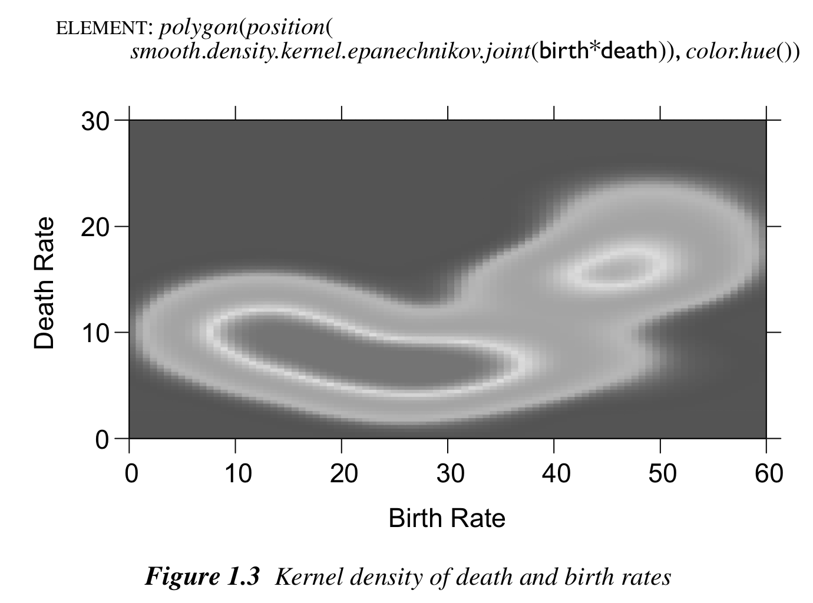
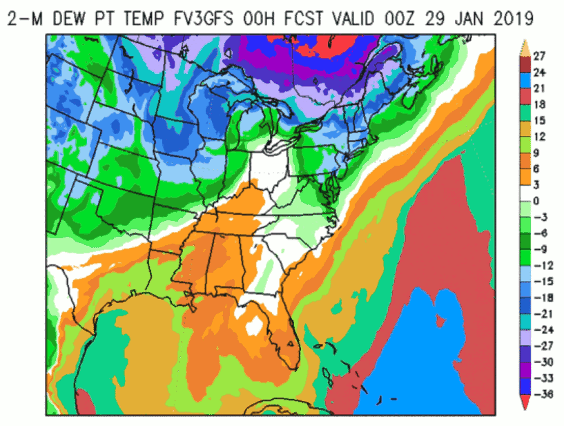
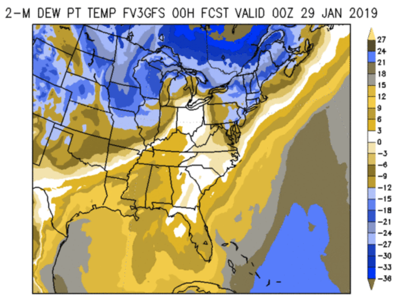

```{r preliminaries, echo=FALSE, message=FALSE}
library("colorspace")
```

## Overview

The go-to palette in many software packages is - or used to be until rather recently -
the so-called rainbow: a palette created by changing the hue in highly-saturated RGB colors.
This has been widely recognized as having a number of disadvantages including: abrupt shifts in brightness,
misleading for viewers with color vision deficiencies, too flashy to look at for a longer time.
See also the article on [color vision deficiencies](color_vision_deficiency.html)
that compares the base R `rainbow()` with better HCL-based alternatives using `demoplot()`.
Here, we provide further rainbow examples taken from actual publications (rather than
simplified demos).

For more details on the limitations of the rainbow palette and further pointers see 
"[The End of the Rainbow](http://www.climate-lab-book.ac.uk/2014/end-of-the-rainbow/)"
by @color:Hawkins+McNeall+Stephenson:2014 or
"[Somewhere over the Rainbow: How to Make Effective Use of Colors in Meteorological Visualizations](https://dx.doi.org/10.1175/BAMS-D-13-00155.1)"
by @color:Stauffer+Mayr+Dabernig:2015 as well as the [\#endrainbow](https://twitter.com/hashtag/endrainbow)
hashtag on Twitter.

In a nutshell, the (in-)famous RGB rainbow palette is virtually always a poor choice
and properly balanced qualitative, sequential, or diverging palettes - such as the
[HCL-based color palettes](hcl_palettes.html) provided here - are preferable. Despite such alternatives becoming more and more
widely available the rainbow palette is unfortunately still widely used. Below we illustrate
some wild-caught examples, highlight their problems (e.g., by desaturation to grayscale
or by emulating color vision deficiencies), and suggest better alternatives.


## Would Bob Ross approve?

When you see a (scientific) data visualization with a rainbow, ask yourself: Would
[Bob Ross](https://www.bobross.com/) approve of this?


       
Most likely not. In contrast, choosing a HCL-based palette instead will yield less
flashy colors that change smoothly...very much in the spirit of _The Joy of Painting_.


## Heatmap from The Grammar of Graphics

Even in the excellent book
["The Grammar of Graphics"](https://www.cs.uic.edu/~wilkinson/TheGrammarOfGraphics/GOG.html)
by @color:Wilkinson:2005, the rainbow palette is used in one of the
first figures, depicting a heatmap of a bivariate kernel density estimate.
The figure is shown below on the left and is contrasted with an HCL-based sequential
heat color palette on the right (`sequential_hcl(99, palette = "Heat")`).

{width=49%}
{width=49%}

The original palette changes back and forth between dark and light
colors and hence high- and low-density regions are difficult to tell apart,
especially when desaturated to grayscale. In contrast, the heat colors
go from light to dark and still work very well in grayscale.

{width=49%}
{width=49%}

Similarly, high- and low-density regions are much harder to distinguish for
colorblind viewers in the original rainbow palette compared to the heat colors.
Below deuteranope vision is emulated.

{width=49%}
{width=49%}


## Map of model deviations

Often a subset of the RGB rainbow palette is used as a "traffic light",
coding "positive" (green) and "negative" (red) deviations from some neutral value (yellow),
e.g., forecast errors or other model deviations, correlations, slopes, etc. A typical example
is shown below, taken from Figure 5 of @color:Kneib:2006, where deviations from a childhood
moratlity model (without spatial effect) for Nigeria are depicted.

The original palette is `rainbow(99, start = 0, end = 1/3)` (left) and as a better alternative
`diverging_hcl(99, "Purple-Green")` is used. This avoids the flashy colors and uses light gray
as the neutral value, making it easier to look at the display for a longer time. Instead of
diverging to red/green the palette diverges to purple/green as this works better for colorblind
viewers (see below).

{width=49%}
{width=49%}

Emulating protanope vision most of the green-yellow contrasts in the RGB rainbow are collpased,
making the plot very misleading while the HCL-based purple/green palette still works very
well for colorblind viewers.

{width=49%}
{width=49%}

Another important difference between the two palettes is that the HCL-based alternative is
completely balanced between the two "arms" of the palette while the rainbow is not. Specifically,
the green arm has an almost flat luminance trajectory while the red arm reaches much lower
luminances (i.e., darker colors).

{width=49%}
{width=49%}


## Weather map: Precipitation

The shaded weather map below was taken from the web site of the
[NOAA](https://www.noaa.gov/) (National Oceanic and Atmospheric Administration)
and it shows a 5-day accumulated precipitation forecast in the United
States during the landfall of Hurricane Sandy in 2012.
The original color palette (left) is not a classic rainbow but also combines
flashy and highly-saturated colors almost everywhere in the palette. For experienced
users of this particular product regions with low (vivid green colors) and
high (reddish colors) precipitation amounts can be quickly identified.
However, it is hard to grasp the message of the figure as a whole.

As an alternative, a proper multi-hue `sequential_hcl(13, "Purple-Yellow")`
palette is used on the right. This has smooth gradients and the overall message
can be grasped quickly, giving focus to the high-precipitation regions depicted
with dark/colorful colors.

{width=49%}
{width=49%}

Converting all colors to grayscale brings out even more clearly why the overall
picture is so hard to grasp with the original palette: The gradients are discontinuous
switching several times between bright and dark. Thus, it is hard to identify the region with
the maximum precipitation forecast while this is very natural and straightforward
with the HCL-based sequential palette.

{width=49%}
{width=49%}

Emulating deuteranope vision emphasizes the same problems as the desaturated version
above but shows even more problems with the original palette.

{width=49%}
{width=49%}

Showing changes in hue/chroma/luminance across the two palettes also highlights
the discontinuity vs. smoothness of the two palettes.

{width=49%}
{width=49%}


## Weather map: Dewpoint temperature

Another shaded map for communicating a weather forecast is shown below, depicting
[dewpoint temperature forecasts](https://www.emc.ncep.noaa.gov/mmb/mmbpll/ncepmods_gfspll.arch/Tue/00z/east.3mods.2mtd_animate.html)
from a certain FV3 Global Forecast System (GFS)
[product](https://www.emc.ncep.noaa.gov/mmb/mmbpll/ncepmods_gfspll/).
It also does not use a standard rainbow but a palette of similarly
highly-saturated colors from a wide range of hues (left panel).

As in the previous section, the palette is very discontinuous and breaks
the values down into separate "classes" or "bands". For experienced users
this may help locating bands with very specific numeric values but leads
to an uneven overall picture. In contrast, the
`sequential_hcl(23, "ag_Sunset")` palette (right panel) shows a smooth
gradient, giving somewhat more emphasis to the darker low-temperature regions.

{width=49%}
{width=49%}

Depicting the hue/chroma/luminance trajectories of both palettes
also shows the abrupt changes in the original palette which do
not convey a continuous temperature scale. Instead, the
HCL-based sunset palette is also built from a wide range of
hues but changes hue, chroma, and luminance smoothly.

{width=49%}
{width=49%}

Consequently, the figure with the sunset palette also works reasonably well
in grayscale or for colorblind viewers while the original palette
is rather problematic.

{width=49%}
{width=49%}

{width=49%}
{width=49%}


## Risk map: Influenza

The shaded map below was taken from the web site of the
[Robert Koch-Institut](https://influenza.rki.de/) (Arbeitsgemeinschaft Influenza)
and it shows the severity of influenza in Germany in week 8, 2019.
The original color palette (left) is the classic rainbow ranging from
"normal" (blue) to "strongly increased" (red). As all colors in the palette
are very flashy and highly-saturated it is hard to grasp intuitively which
areas are most affected by influenza. Also, the least interesting "normal" areas
stand out as blue is the darkest color in the palette.

As an alternative, a proper multi-hue `sequential_hcl(99, "Purple-Yellow")`
palette is used on the right. This has smooth gradients and the overall message
can be grasped quickly, giving focus to the high-risk regions depicted
with dark/colorful colors. However, the extremely sharp transitions
between "normal" and "strongly increased" areas (e.g., in the North and the East)
might indicate some overfitting in the underlying smoothing for the map.

{width=49%}
{width=49%}

Converting all colors to grayscale brings out even more clearly why the overall
picture is so hard to grasp with the original palette: The gradients are discontinuous
switching several times between bright and dark. Thus, it is hard to identify the
high-risk regions with while this is more natural and straightforward
with the HCL-based sequential palette.

{width=49%}
{width=49%}

Emulating deuteranope vision emphasizes the same problems as the desaturated version
above but shows even more problems with the original palette.

{width=49%}
{width=49%}

Showing changes in hue/chroma/luminance across the two palettes also highlights
the discontinuity vs. smoothness of the two palettes.

{width=49%}
{width=49%}


## References
