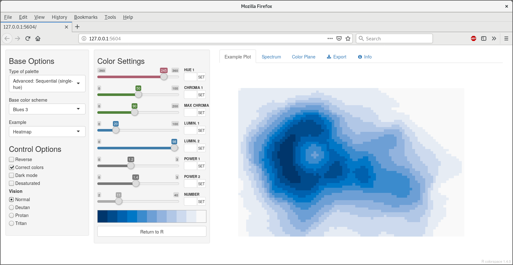
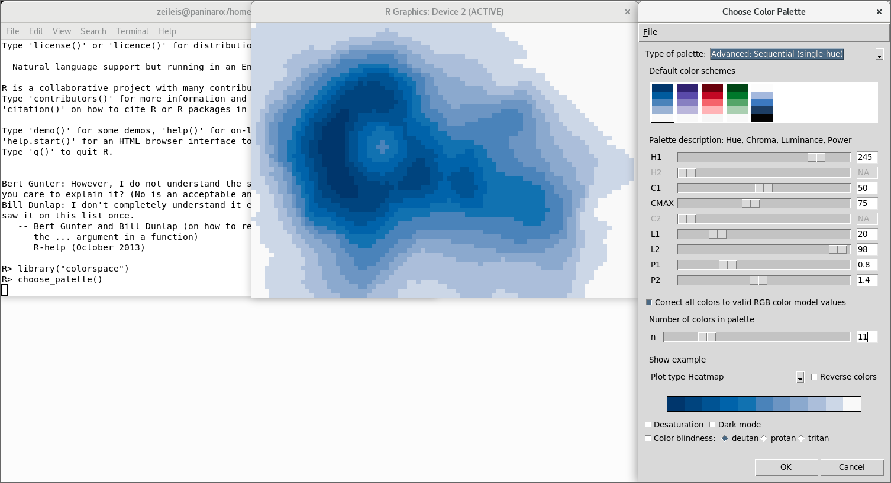
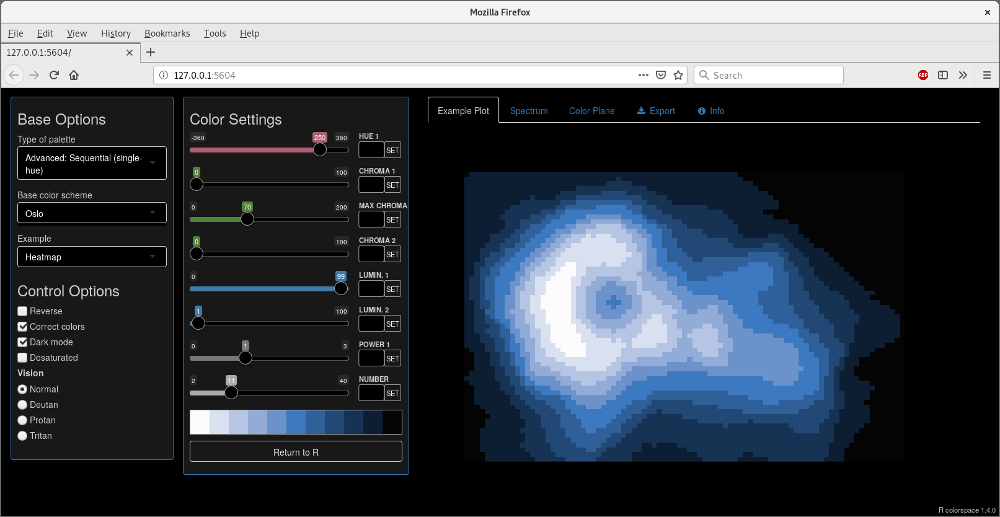
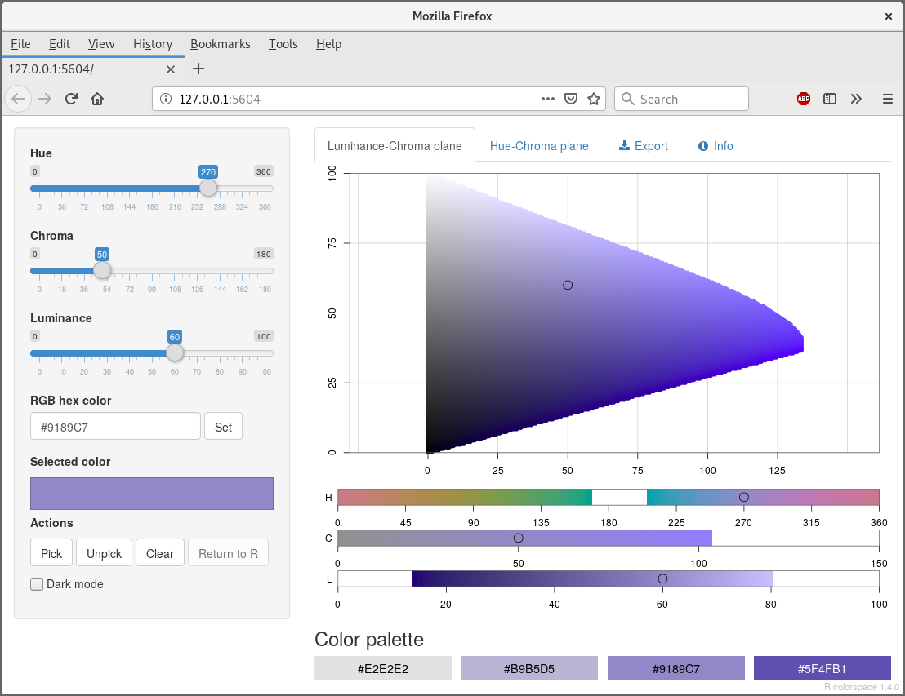
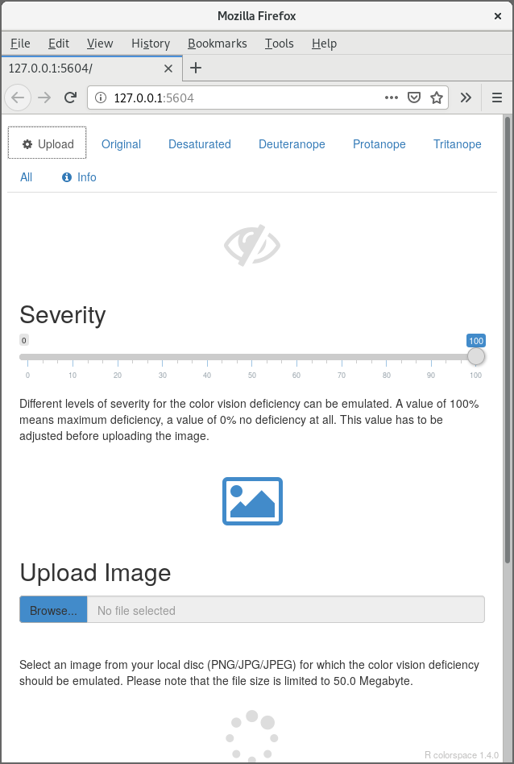
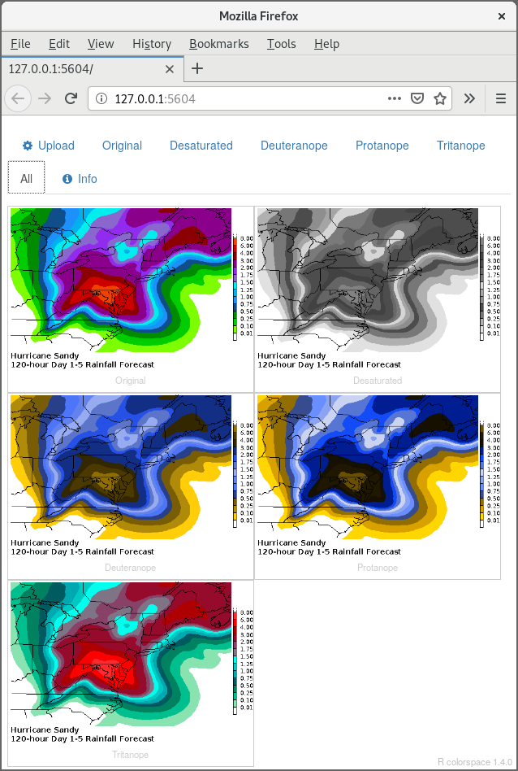

```{r preliminaries, echo=FALSE, message=FALSE}
library("colorspace")
```

## Overview

To facilitate exploring the package and employing it when working with colors,
several graphical user interfaces (GUIs) are provided within the package as
_shiny_ apps [@color:shiny]. All of these GUIs or apps can either be run locally
from within R but are also provided at <http://hclwizard.org/>.

* **HCL color palette construction:** `choose_palette()` or `hclwizard()` or `hcl_wizard()`.  
  In addition to the _shiny_ app, this is also available as a Tcl/Tk GUI via R package
  _tcltk_ shipped with base R [@color:R]. The _tcltk_ version can only be run locally
  and is considerably faster while the _shiny_ version has a nicer interface with more
  features  and can be run online. The `choose_palette()` function by default starts the
  _tcltk_ version while `hclwizard()`/`hcl_wizard()` by default starts the _shiny_
  version.
* **HCL color picker:** `choose_color()` or equivalently `hcl_color_picker()`.
* **Color vision deficiency emulator:** `cvd_emulator()`.


## Choosing palettes with the HCL color model


This GUI can either be started with `hclwizard()` (or equivalently `hcl_wizard()`) which
by default starts the _shiny_:



The _tcltk_ version is started by default with `choose_palette()`:



 However, all defaults can be modified by setting  `gui = "tcltk"` or `"shiny"`.

The GUIs interface the palette functions `qualitative_hcl()` for qualitative palettes,
`sequential_hcl()` for sequential palettes with single or
multiple hues, and `diverging_hcl()` for diverging palettes (composed
from two single-hue sequential palettes). See the discussion of
[HCL-based color palettes](hcl_palettes.html) for more details.

The GUIs
allow for interactive modification of the arguments of the respective
palette-generating functions, i.e., starting/ending hue (wavelength, type of
color), minimal/maximal chroma (colorfulness), minimal maximal luminance
(brightness, amount of gray), and a power transformations that control how
quickly/slowly chroma and/or luminance are changed through the palette.
Subsets of the parameters may not be applicable depending on the type of
palette chosen. See `qualitative_hcl()` and @color:Zeileis+Hornik+Murrell:2009 for
a more detailed explanation of the different arguments. 
@color:Stauffer+Mayr+Dabernig:2015 provide more examples and guidance.

Optionally, active palette can be illustrated by using a range of examples
such as a map, heatmap, scatter plot, perspective 3D surface etc.
To demonstrate different types of deficiencies, the active palette may be
desaturated (emulating printing on a grayscale printer) and collapsed to
emulate different types of color-blindness (without red-green or green-blue
contrasts) using the `simulate_cvd()` functions. To facilitate generation of
palettes for black/dark backgrounds, a "dark mode" of the GUIs is also available:




## Choosing individual colors with the HCL color model

This GUI can be started with either `choose_color()` or equivalently `hcl_color_picker()`.



It shows the HCL color space either as a hue-chroma plane for a given luminance value or
as a luminance-chroma plane for a given hue. Colors can be entered by:

* Clicking on a color coordinate in the hue-chroma or luminance-chroma plane.
* Specifying the hue/chroma/luminance values via sliders.
* Entering an RGB hex code.

By repeating the selection a palette of colors can be constructed and returned
within R for subsequent usage in visualizations.


## Emulate color vision deficiencies

This GUI can be started with `cvd_emulator()`.

{width=49%}
{width=49%}

It allows to upload a raster image in
JPG or PNG format which is then check for various kinds of color vision deficiencies
at the selected severity. By default the severity is set to 100% and all supported
kinds of color vision deficiency are checked for, i.e.,

* Monochromatic (desaturated grayscale).
* Deuteranope vision (green deficient).
* Protanope vision (red deficient).
* Tritanope vision (blue deficient).


## References
